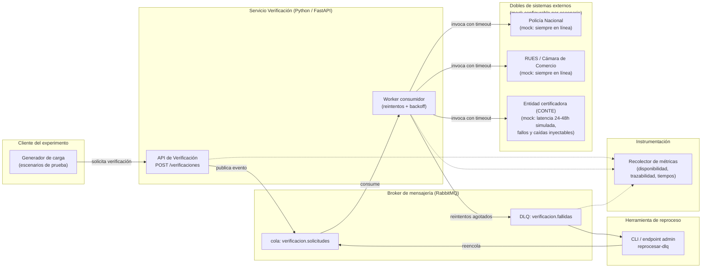

# Experimento de Arquitectura — DISP-03

Hogar de los Alpes (HdA) — Validación de disponibilidad en la Verificación de Proveedores
ante fallas de entidades certificadoras externas

| | |
|---|---|
| **Escenario de calidad** | DISP-03 (Disponibilidad, prioridad H) |
| **Estado** | Implementado y validado localmente (7/7 casos de prueba pasan contra el stack real); Terraform validado sintácticamente, no aplicado contra un proyecto GCP real |
| **Stack objetivo** | Python |
| **Fuente del escenario** | `escenarios_calidad.md` (adjuntado por el usuario), sección Disponibilidad |
| **Artefactos relacionados** | `06-vista-cyc.puml`, `08-atributos-calidad.md`, `05-vista-modulo.puml` |
| **Rúbrica aplicable** | `../REGLAS-DURAS-rubrica-entrega-3.md` — ver Regla 2 (campos faltantes por escenario) y Regla 5 (si este servicio es el elegido para la implementación DDD obligatoria) |

---

## 1. Resumen ejecutivo

El enunciado del proyecto pide explícitamente: *"El equipo de ingeniería desea también validar sus
decisiones de diseño. Por ende, se debe construir POC/experimentos para soportar sus decisiones y
poderlas presentar al equipo de ingeniería."* Este documento planifica el primer experimento de
arquitectura del TO-BE: validar que el proceso de **Verificación de Proveedores** puede sostener
**Disponibilidad ≥ 99.9%** aun cuando los sistemas externos de verificación (Policía Nacional, RUES,
entidades certificadoras como CONTE) fallan, se caen o responden con la latencia real documentada de
24–48h, y que el **100% de las verificaciones fallidas queden trazables en una Dead Letter Queue (DLQ) y
sean reprocesables en menos de 24h**.

Este es el escenario **DISP-03** del árbol de utilidad de Disponibilidad. Se elige como primer
experimento porque, a diferencia de DISP-01 y DISP-02 (que ya tienen soporte explícito en la Vista C&C
alrededor de Gestión de Trabajos — ver `06-vista-cyc.puml`), **DISP-03 hoy es el único escenario de
disponibilidad de prioridad H que todavía no está respaldado por ningún diagrama** (ver nota de
pendientes #5 en `escenarios_calidad.md`). El experimento sirve, por tanto, doble propósito:

1. Validar empíricamente que el patrón (cola asíncrona + reintentos + DLQ) que ya funcionó en
   Gestión de Trabajos (DISP-01/02) es igualmente aplicable al contexto de Proveedores/Verificación.
2. Producir evidencia concreta (métricas, logs, código) que informe cómo cerrar el gap de diseño
   pendiente en la Vista C&C antes de la entrega final.

---

## 2. Escenario de calidad bajo prueba

Tabla ATAM completa, tal como está documentada en `escenarios_calidad.md` (Disponibilidad · DISP-03):

| Campo | Contenido |
|---|---|
| **Fuente** | Entidades certificadoras externas (ej. CONTE) durante la verificación de proveedores — hoy con tiempo de respuesta de 24–48h, a diferencia de Policía Nacional y Cámara de Comercio/RUES, que responden en línea |
| **Estímulo** | Un sistema externo de verificación no responde o falla durante el registro, aprobación por servicio/zona o re-validación de un proveedor |
| **Artefacto** | Verificación (submódulo de Proveedores) + Bus de Eventos / Dead Letter Queue |
| **Ambiente** | Operación 24/7, fase de verificación/re-validación de proveedores |
| **Respuesta** | La verificación pendiente queda en espera sin bloquear al resto de la cola; tras agotar reintentos, el evento se enruta a la DLQ para revisión manual, sin detener la coreografía global |
| **Medida de la respuesta** | Disponibilidad del proceso de verificación ≥ 99.9%; 100% de las verificaciones fallidas quedan trazables en la DLQ y reprocesables en < 24h |

### 2.1 Por qué importa (contexto de negocio)

Según el enunciado del proyecto (`utils/Proyecto-202614-HogarDeLosAlpes.pdf`), la verificación de
proveedores hoy la ejecutan **agentes humanos** accediendo manualmente a sistemas externos, es
"lento y costoso", y la compañía **quiere optimizarlo con IA sin sacrificar la seguridad**. Con la
expansión a México, Brasil y Argentina se espera pasar de +45.000 a +100.000 proveedores registrados
en 3 años — sin un mecanismo de desacople y recuperación ante fallos de terceros, ese crecimiento
multiplicaría directamente el impacto de cada caída de una entidad certificadora sobre el pipeline
de onboarding de proveedores, bloqueando marketplace y claims por igual.

### 2.2 Relación con otros artefactos del proyecto

- **`08-atributos-calidad.md`**: Disponibilidad/Elasticidad es uno de los 3 atributos priorizados;
  el patrón que la resuelve según ese documento es "arquitectura orientada a eventos... DLQ para
  picos". DISP-03 es la instancia concreta de ese patrón aplicada a Verificación en vez de a
  Gestión de Trabajos.
- **`06-vista-cyc.puml`**: ya modela el patrón DLQ + ACL/circuit breaker para el proceso de
  Gestión de Trabajos (nodo `GT`, cola `DLQ trabajo.fallidos`). Este experimento reutiliza la misma
  táctica arquitectónica pero la aplica y la mide sobre un componente distinto (Verificación), que
  hoy no aparece en ese diagrama.
- **Nota de pendientes #5** (`escenarios_calidad.md`): señala que la Vista C&C actual "no respalda"
  DISP-03 y que falta (a) el sistema externo de verificación como caja de Contexto Externo, y
  (b) el DLQ conectado al contexto de Proveedores/Verificación, no solo al de Gestión de Trabajos.
  **Este experimento es el insumo para cerrar ese pendiente**: el diagrama del PoC (sección 5.1)
  se diseña ya con esa forma, para poder trasladarse directamente a la Vista C&C una vez validado.

---

## 3. Objetivo del experimento

Determinar, mediante un PoC ejecutable e instrumentado, si la combinación de tácticas arquitectónicas
**cola asíncrona de desacople + reintentos con backoff + Dead Letter Queue + reproceso manual/asistido**
permite que el proceso de Verificación de Proveedores cumpla las dos medidas de respuesta de DISP-03
cuando una o más entidades certificadoras externas fallan, se degradan en latencia, o quedan
indisponibles por un período prolongado.

### 3.1 Pregunta que responde el experimento

> Cuando una entidad certificadora externa (tipo CONTE) no responde, responde con error, o excede su
> SLA documentado de 24–48h, **¿el proceso de Verificación de Proveedores sigue disponible para el
> resto de proveedores (≥ 99.9%), y las verificaciones afectadas quedan 100% trazables y
> reprocesables en menos de 24h, sin intervención en el resto de la cola?**

### 3.2 Hipótesis

- **H1 (hipótesis de trabajo):** Encolar cada solicitud de verificación de forma asíncrona, aplicar
  reintentos con backoff exponencial acotado, y enrutar a una DLQ tras agotar reintentos, permite que
  el resto de solicitudes de verificación (dirigidas a otros proveedores, u otro sistema externo)
  sigan procesándose sin degradación medible, cumpliendo ambas medidas de respuesta de DISP-03.
- **H0 (nula):** Sin ese desacople (p. ej. invocación síncrona directa al sistema externo dentro del
  flujo principal de verificación), la caída o degradación de un solo sistema externo certificador
  degrada o bloquea la disponibilidad del proceso completo de Verificación, incumpliendo el ≥ 99.9%.

El experimento se diseña para poder **falsar H1**: si bajo fallo sostenido del externo la
disponibilidad medida cae por debajo de 99.9%, o si alguna verificación fallida se pierde sin quedar
trazada en la DLQ, la hipótesis se rechaza y el diseño debe ajustarse antes de la entrega final.

---

## 4. Tácticas arquitectónicas bajo prueba

Basado en el catálogo de tácticas de disponibilidad (Bass, Clements & Kazman — *Software Architecture
in Practice*, usado como referencia estándar en el curso):

| Táctica | Propósito en DISP-03 |
|---|---|
| **Desacople productor/consumidor (cola asíncrona)** | La solicitud de verificación se acepta y se encola inmediatamente; el llamado al sistema externo ocurre fuera del hilo/request que atiende al cliente. Evita que la latencia de 24–48h de una certificadora bloquee el resto del sistema. |
| **Timeout** | Cada intento de invocación al sistema externo tiene un límite de espera explícito; nunca se espera indefinidamente una respuesta. |
| **Reintento con backoff exponencial + jitter** | Ante timeout o error transitorio, se reintenta un número acotado de veces con espera creciente, para no saturar un externo ya degradado (evita "reintento en estampida"). |
| **Dead Letter Queue (DLQ)** | Tras agotar reintentos, el mensaje se enruta a una cola separada en vez de perderse o bloquear la cola principal — garantiza trazabilidad del 100% de los fallos. |
| **Reproceso manual/asistido** | Mecanismo explícito (CLI o endpoint) para inspeccionar la DLQ y reencolar un evento una vez el sistema externo se recupera, dentro de la ventana de < 24h exigida. |
| **Aislamiento por partición/routing key** | Los mensajes se enrutan por tipo de verificador externo (Policía, RUES, certificadora), de forma que la caída de uno no compita por los mismos reintentos/recursos que los otros dos, que sí responden en línea. |

> Nota: a diferencia de DISP-01/02 (que usan explícitamente *circuit breaker*), DISP-03 no lo
> requiere como táctica central porque el estímulo ya asume una latencia alta esperada (24–48h) como
> comportamiento normal del sistema, no solo como falla. El circuit breaker se evalúa como extensión
> opcional (ver sección 8) para el caso de fallo duro (5xx/timeout de red), donde sí evita reintentos
> inútiles contra un servicio caído.

---

## 5. Diseño del experimento

### 5.1 Arquitectura del PoC

**Componentes del PoC:**

1. **API de Verificación** (`FastAPI`): expone `POST /verificaciones` — acepta la solicitud, la
   persiste con estado `PENDIENTE` y la publica en la cola principal. Responde de inmediato (no
   espera al sistema externo), lo cual ya por sí mismo es la primera evidencia de desacople.
2. **Worker consumidor** (`aio-pika` sobre RabbitMQ): consume la cola principal, invoca al sistema
   externo correspondiente con timeout, aplica reintentos con backoff exponencial + jitter, y en
   caso de agotar reintentos, publica el mensaje a la DLQ con el motivo de falla adjunto.
3. **Dobles de sistemas externos** (`FastAPI` + variables de entorno de control): tres servicios
   mock — Policía Nacional y RUES siempre responden rápido (según el enunciado, "responden en
   línea"); la Entidad Certificadora es **configurable por escenario**: latencia fija, latencia
   variable, tasa de error, o caída total durante una ventana de tiempo.
4. **DLQ + herramienta de reproceso**: cola separada en RabbitMQ (Dead Letter Exchange nativo) más
   un CLI simple que lista los mensajes en DLQ, permite inspeccionarlos y reencolarlos.
5. **Recolector de métricas**: cada componente emite eventos con timestamp a un log estructurado
   (JSON lines); un script de post-proceso calcula las métricas de la sección 6 a partir de esos logs.
6. **Generador de carga / escenarios de prueba**: script Python (`asyncio` + `httpx`) que dispara
   solicitudes de verificación según los casos de prueba de la sección 5.3, y controla el estado de
   los dobles externos (vía su API de control) para inyectar fallas en el momento preciso.

### 5.2 Alcance y fuera de alcance

**Dentro de alcance:**
- Simular los tres tipos de verificador externo (Policía, RUES, certificadora) como servicios mock
  independientes con comportamiento configurable.
- Medir disponibilidad del proceso de Verificación end-to-end (aceptación + encolado), no la
  disponibilidad de los sistemas externos en sí (esos están fuera de nuestro control, como señala
  el enunciado del proyecto).
- Validar trazabilidad al 100% de las verificaciones fallidas en DLQ.
- Validar reproceso manual dentro de la ventana de 24h (comprimida en el experimento, ver 5.4).
- Aislamiento entre verificadores: que la caída de la certificadora no afecte verificaciones que
  solo dependen de Policía/RUES.

**Fuera de alcance (para este primer experimento):**
- Autenticación/autorización real contra Policía Nacional, RUES o CONTE (se usan dobles, no
  integraciones reales — no hay acceso ni es apropiado probar contra sistemas de terceros).
- Auto-scaling horizontal del worker (eso es el foco de ESC-01/ESC-03, un experimento distinto).
- UI de revisión manual de la DLQ (se valida con CLI/API; UI queda para una iteración posterior si
  el equipo de ingeniería lo pide).
- Circuit breaker como táctica principal (se deja como extensión opcional, sección 8).

### 5.3 Variables del experimento

**Variables independientes (lo que el experimento controla/inyecta):**

| Variable | Valores a probar |
|---|---|
| Estado del externo "certificadora" | Disponible (latencia normal) / Latencia alta sostenida / Tasa de error parcial (ej. 30%, 70%) / Caída total (100% timeout) |
| Duración de la falla | Corta (recupera antes de agotar reintentos) / Larga (agota reintentos → DLQ) / Sostenida (> ventana de reproceso) |
| Volumen concurrente de solicitudes | Bajo (baseline) / Medio / Alto (para observar si el fallo de un externo satura recursos compartidos) |
| Mezcla de verificadores por solicitud | Solo Policía+RUES (deben verse no afectadas) / Policía+RUES+Certificadora (las que sí deben degradar de forma controlada) |

**Variables dependientes (lo que se mide, mapeado 1:1 a la medida de respuesta de DISP-03):**

| Variable medida | Corresponde a |
|---|---|
| % de solicitudes de verificación aceptadas y encoladas exitosamente durante la ventana de falla | Disponibilidad del proceso de verificación ≥ 99.9% |
| % de verificaciones afectadas por Policía/RUES cuando solo la certificadora está caída | Aislamiento (debe ser 0% de impacto) |
| % de verificaciones fallidas que aparecen en la DLQ con motivo trazado | 100% de trazabilidad |
| Tiempo entre el fallo definitivo (agotamiento de reintentos) y la disponibilidad del mensaje para reproceso | < 24h (comprimido) |
| Tiempo de reproceso exitoso tras recuperación del externo, tras intervención manual | < 24h (comprimido) |
| Latencia de aceptación de la API (`POST /verificaciones`) durante la falla del externo | Debe mantenerse estable — evidencia de que el desacople funciona (no hay espera síncrona) |

### 5.4 Compresión de la escala temporal

El escenario real habla de un SLA de 24–48h de la certificadora y una ventana de reproceso de < 24h.
Ejecutar el experimento en tiempo real sería inviable. Se define un **factor de compresión temporal
explícito y documentado**: 1 minuto simulado ≈ 1 hora real (configurable por variable de entorno en
los dobles y en el worker), de forma que:

- Una "caída de 48h" del externo se simula como ~48 minutos de indisponibilidad continua del doble.
- La ventana de reproceso de "< 24h" se valida como "< 24 minutos" en la ejecución del experimento.

Este factor de compresión se declara como **amenaza a la validez** en la sección 9 — el experimento
valida el *mecanismo* (desacople, DLQ, reproceso), no el comportamiento del sistema bajo latencias de
horas reales de forma continua (p. ej. fugas de memoria o vencimiento de conexiones a las 40h no
quedarían cubiertas por este PoC).

---

## 6. Casos de prueba

| # | Escenario | Estímulo inyectado | Resultado esperado | Métrica de éxito |
|---|---|---|---|---|
| CP-1 | Baseline — todo disponible | Los 3 externos responden con latencia normal | 100% de verificaciones se completan sin pasar por DLQ | Disponibilidad = 100%, DLQ vacía |
| CP-2 | Certificadora lenta (dentro de SLA) | Certificadora responde en 24–48h simulados, sin error | Verificación queda `PENDIENTE` sin bloquear otras; se completa al responder el externo | Disponibilidad ≥ 99.9%, 0 mensajes en DLQ |
| CP-3 | Certificadora con errores intermitentes | 30–70% de tasa de error transitorio | Reintentos con backoff logran completar la mayoría; el resto va a DLQ | Disponibilidad ≥ 99.9%, 100% de los fallidos trazados en DLQ |
| CP-4 | Certificadora caída (falla dura y sostenida) | 100% timeout/error durante > tiempo de reintentos | Tras agotar reintentos, 100% de esas verificaciones quedan en DLQ; el resto del sistema sigue operando | Disponibilidad del proceso ≥ 99.9% (excluyendo las que legítimamente dependen del externo caído), trazabilidad = 100% |
| CP-5 | Aislamiento — certificadora caída, Policía/RUES sanos | Caída total de certificadora, mientras llegan verificaciones que solo requieren Policía/RUES | Las verificaciones que no dependen de la certificadora se completan con normalidad | 0% de impacto medido en esas verificaciones |
| CP-6 | Recuperación y reproceso | Tras CP-4, la certificadora se restablece; se ejecuta reproceso desde DLQ | Los mensajes en DLQ se reencolan y completan exitosamente | 100% reprocesados, dentro de la ventana comprimida de 24h |
| CP-7 | Carga concurrente con falla simultánea | Volumen alto de solicitudes mientras la certificadora cae a mitad de la ejecución | El desacople evita saturación del hilo principal; la API mantiene latencia de aceptación estable | Latencia de aceptación de `POST /verificaciones` sin degradación significativa (< 5% de variación vs. baseline) |

---

## 7. Plan de ejecución

| Fase | Contenido | Entregable |
|---|---|---|
| **1. Preparación** | Levantar `docker-compose` con RabbitMQ, API de Verificación, dobles de externos y worker | Entorno reproducible, `docker-compose up` funcional |
| **2. Instrumentación** | Logging estructurado en cada componente; script de cálculo de métricas a partir de logs | Script `calcular_metricas.py` |
| **3. Ejecución de casos base (CP-1, CP-2)** | Validar comportamiento sin fallas y con latencia dentro de SLA | Reporte baseline |
| **4. Ejecución de casos de falla (CP-3, CP-4, CP-5)** | Inyección de fallas controladas vía API de control de los dobles | Reporte de disponibilidad y trazabilidad bajo falla |
| **5. Ejecución de recuperación y carga (CP-6, CP-7)** | Validar reproceso y comportamiento bajo concurrencia | Reporte de recuperación |
| **6. Consolidación de resultados** | Comparar métricas obtenidas vs. umbrales de DISP-03; conclusión H1/H0 | Informe final del experimento |
| **7. Retroalimentación al diseño** | Actualizar Vista C&C (`06-vista-cyc.puml` o nueva vista) con el patrón validado para Verificación, cerrando el pendiente #5 | Diagrama actualizado + changelog |

---

## 8. Stack tecnológico y justificación

| Componente | Tecnología | Justificación |
|---|---|---|
| Lenguaje | **Python 3.12** | Definido por el usuario; consistente para todo el experimento. |
| API de Verificación y dobles externos | **FastAPI** | Async nativo, tipado con Pydantic, ideal para exponer endpoints de control de fallas en los mocks (ej. `POST /mock/certificadora/config`). |
| Broker de mensajería | **RabbitMQ** | Soporta *Dead Letter Exchange* nativo (`x-dead-letter-exchange`), lo que modela DISP-03 con configuración de infraestructura en vez de lógica ad-hoc — más fiel a cómo se implementaría en producción. |
| Cliente de mensajería | **aio-pika** | Cliente async de RabbitMQ para Python, se integra bien con FastAPI/asyncio. |
| Reintentos con backoff | **tenacity** | Librería estándar de Python para backoff exponencial + jitter, declarativa y fácil de auditar en el código del worker. |
| Circuit breaker (extensión opcional, sección 9) | **purgatory** o implementación propia mínima | Solo si se decide incluir la extensión de fallo duro. |
| Generador de carga / orquestador de escenarios | **`httpx` + `asyncio`**, script propio | Suficiente para los volúmenes de este PoC (no se requiere Locust a esta escala; se documenta como posible extensión si se necesita mayor concurrencia). |
| Orquestación del entorno | **Docker Compose** | Reproducibilidad total del experimento en cualquier máquina, sin dependencias manuales. |
| Pruebas y verificación de casos | **pytest + pytest-asyncio** | Cada caso de prueba (sección 6) se automatiza como test, para poder re-ejecutar el experimento como parte de un pipeline. |
| Métricas y reporte | Logging estructurado (`structlog` o JSON logging estándar) + script de agregación en `pandas` | Simplicidad; no se requiere Prometheus/Grafana para un PoC de esta escala, pero queda documentado como upgrade natural si el equipo de ingeniería lo pide. |

---

## 9. Criterios de éxito / fracaso

El experimento se considera **exitoso (valida H1)** si, en todos los casos de prueba de la sección 6:

- La disponibilidad medida del proceso de Verificación se mantiene **≥ 99.9%** durante y después de
  cada ventana de falla inyectada (excluyendo, del cálculo, las verificaciones que legítimamente
  dependen del sistema caído mientras está caído — esas se consideran `PENDIENTE`, no indisponibles,
  siempre que queden encoladas y no se pierdan).
- **100%** de las verificaciones que agotan reintentos aparecen en la DLQ con motivo de falla
  trazado (ninguna se pierde silenciosamente).
- El reproceso desde DLQ tras la recuperación del externo se completa dentro de la ventana comprimida
  equivalente a **< 24h reales**.
- Las verificaciones que dependen solo de Policía/RUES **no se ven afectadas** cuando únicamente la
  certificadora está caída (aislamiento).

El experimento se considera **fallido (rechaza H1, valida H0)** si se observa cualquiera de:

- Pérdida de mensajes (una verificación fallida que no llega a la DLQ).
- Bloqueo del hilo principal / degradación medible de la latencia de aceptación de la API mientras
  el externo está caído (evidencia de que el desacople no es efectivo).
- Propagación de la falla de la certificadora hacia verificaciones que no la requieren.
- Reprocesos que no completan dentro de la ventana definida, o que requieren intervención fuera del
  flujo de DLQ diseñado.

Un resultado fallido no invalida el experimento — es información igual de valiosa: indicaría qué
ajuste de diseño se necesita antes de trasladar el patrón a la Vista C&C definitiva.

---

## 10. Riesgos, supuestos y amenazas a la validez

| Tipo | Descripción | Mitigación |
|---|---|---|
| **Supuesto** | Los sistemas externos reales (Policía, RUES, CONTE) tienen contratos de API asimilables a REST/HTTP con respuesta síncrona eventual | Se documenta como supuesto; si en el diseño de detalle se descubre que alguno usa otro protocolo (ej. SFTP batch), el mock deberá ajustarse |
| **Amenaza a validez (compresión temporal)** | El factor de compresión 1min≈1h no captura fenómenos que solo aparecen en fallas de larga duración real (ej. vencimiento de credenciales, fugas de recursos) | Declarado explícitamente en 5.4; se documenta como límite conocido del PoC, no oculto en el reporte final |
| **Amenaza a validez (entorno de un solo nodo)** | El PoC corre en `docker-compose` local, sin la topología distribuida real (múltiples instancias, red entre países) | El experimento valida el patrón/mecanismo, no el comportamiento a escala productiva — se declara así en las conclusiones |
| **Riesgo** | El equipo de ingeniería podría requerir circuit breaker explícito si el mock revela reintentos que saturan al externo incluso con backoff | Se deja como extensión evaluable (sección 8 de tácticas) si CP-4/CP-7 muestran ese comportamiento |
| **Riesgo** | RabbitMQ vs. Kafka: la elección de RabbitMQ para este PoC no predetermina la elección final del Bus de Eventos para toda la plataforma (ver `05-vista-modulo.puml`, SP5) | Se documenta explícitamente que este experimento evalúa la **táctica**, no fija la tecnología de bus definitiva para HdA |

---

## 11. Entregables de este experimento

1. Este documento de planificación (`plan.md`).
2. Código fuente del PoC (API, worker, dobles de externos, CLI de reproceso, scripts de escenarios) —
   en `09-experimento-DISP-03/src/` (a implementar).
3. `docker-compose.yml` reproducible.
4. Suite de pruebas automatizadas (`pytest`) que ejecuta los 7 casos de prueba de la sección 6.
5. Informe de resultados con métricas obtenidas vs. umbrales de DISP-03, y veredicto H1/H0.
6. Propuesta de actualización a la Vista C&C (`06-vista-cyc.puml`) que incorpore el patrón validado
   para Verificación/Proveedores, cerrando el pendiente #5 documentado en `escenarios_calidad.md`.
7. Presentación breve (5–10 min) para el equipo de ingeniería, según lo exige el enunciado del
   proyecto.

---

## 12. Próximos pasos

- [ ] Confirmar con el usuario el factor de compresión temporal exacto y los umbrales de tasa de
      error a usar en CP-3.
- [ ] Implementar `docker-compose.yml` con RabbitMQ + API de Verificación + dobles + worker.
- [ ] Implementar los dobles de sistemas externos con API de control de fallas.
- [ ] Implementar el worker con reintentos (`tenacity`) y publicación a DLQ (DLX de RabbitMQ).
- [ ] Implementar CLI/endpoint de reproceso desde DLQ.
- [ ] Automatizar los 7 casos de prueba como tests `pytest`.
- [ ] Ejecutar, recolectar métricas y redactar el informe de resultados.
- [ ] Actualizar la Vista C&C con el patrón validado.
