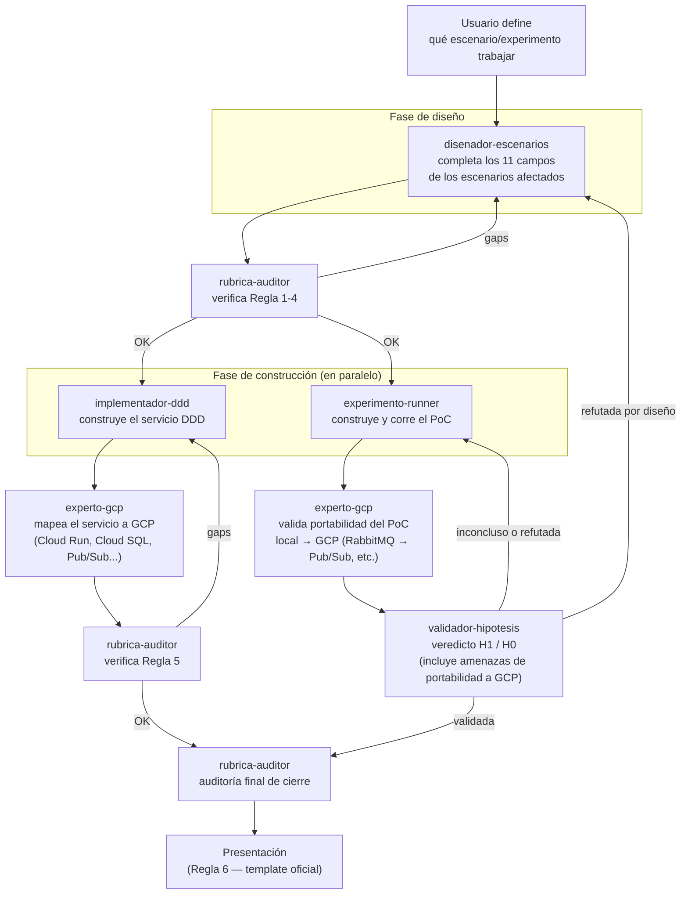

# Estructura multiagéntica — Entrega 3

Hogar de los Alpes (HdA) — cómo se garantiza calidad del entregable y del producto, y cómo se valida
o refuta la hipótesis del experimento de arquitectura.

## Por qué existe este documento

El enunciado del proyecto (`experimento-arquitectura/utils/Proyecto-202614-HogarDeLosAlpes.pdf`,
sección "Objetivo") pide explícitamente: *"Su documento debe considerar los diferentes puntos de
vista y la estructura de equipo que necesita para lograr el cometido."* Este documento responde esa
parte del enunciado, y a la vez sirve como especificación operativa real: los "roles de equipo" que
describe están implementados como texto plano en `.claude/agents/*.md`, invocables como subagentes
nativos en Claude Code y legibles/seguibles por cualquier otro asistente (Gemini CLI, Codex CLI, u
otro) que el resto del equipo use — ver `AGENTS.md` en la raíz del repo, que es el punto de entrada
pensado para eso. El equipo no usa una sola herramienta: cada rol se documentó como instrucción
autocontenida precisamente para no depender de que todos usen Claude Code.

El fin último de esta estructura, tal como se definió con el usuario, es doble:

1. **Garantizar la calidad del entregable** (cumplimiento de rúbrica) **y del producto final**
   (código del servicio, arquitectura del experimento).
2. **Comprobar o refutar la hipótesis** de cada experimento de arquitectura a partir de evidencia —
   no asumir que "porque se construyó, funcionó".

## Los 6 roles y su separación de responsabilidades

| Agente | Responsabilidad | Lo que NO hace |
|---|---|---|
| **`rubrica-auditor`** | Verifica el estado del repositorio contra `REGLAS-DURAS-rubrica-entrega-3.md`, regla por regla, con impacto en puntaje | No corrige nada — solo reporta gaps |
| **`disenador-escenarios`** | Completa/extiende los 9 escenarios de calidad con los 11 campos exigidos (los 6 de ATAM + decisión arquitectural, puntos de sensibilidad, tradeoffs, riesgos, rationale+diagrama) | No implementa código ni ejecuta experimentos |
| **`implementador-ddd`** | Construye el microservicio elegido con DDD + hexagonal + persistencia real + eventos de dominio + CQS (Regla 5, 45pt) | No diseña escenarios ni corre el PoC de fault-injection |
| **`experto-gcp`** | Traduce cada decisión/patrón a servicios concretos de GCP (Pub/Sub, Cloud Run, Cloud SQL/Firestore/Spanner, regiones LATAM), valida portabilidad del PoC local hacia GCP, estima capacidad/costo, produce Terraform | No decide modelo de dominio ni cambia umbrales de escenarios — solo plataforma/infraestructura |
| **`experimento-runner`** | Construye y ejecuta el PoC del experimento (docker-compose, dobles de sistemas externos, inyección de fallas, casos de prueba), produce **datos crudos** | No concluye si la hipótesis se valida o refuta — solo reporta números |
| **`validador-hipotesis`** | Evalúa de forma independiente y escéptica los datos crudos contra los criterios de éxito/fracaso del plan, y emite el veredicto H1/H0 | No construye, no implementa, no ejecuta de nuevo el experimento |

### Decisión de plataforma: GCP

El equipo definió **Google Cloud Platform como la nube objetivo de despliegue** para el sistema
TO-BE. Esta es una restricción de diseño tan dura como los umbrales numéricos de los escenarios de
calidad: cualquier patrón/táctica que se proponga (bus de eventos, auto-scaling, DLQ, circuit
breaker) debe tener una traducción viable a un servicio real de GCP, no quedarse en un nombre
genérico. `experto-gcp` es responsable de esa traducción y de dejar explícito cuándo el stack local
de un experimento (p. ej. RabbitMQ en `implementacion/DISP-03/plan.md`) difiere de su equivalente en
GCP (Pub/Sub) de una forma que podría afectar la validez de las conclusiones — ese hallazgo alimenta
directamente el trabajo de `validador-hipotesis`.

### Por qué `experimento-runner` y `validador-hipotesis` están separados

Esta es la decisión de diseño más importante de esta estructura. Si el mismo agente construye el PoC
**y** decide si "salió bien", el incentivo (consciente o no) es interpretar los datos a favor del
diseño que él mismo construyó. Separar "quien genera evidencia" de "quien la juzga" es la misma
lógica detrás de por qué un auditor no audita su propio trabajo, o por qué en experimentación
científica el análisis de datos idealmente lo hace alguien sin stake en el resultado. `validador-
hipotesis` tiene instrucciones explícitas de sesgo escéptico: buscar primero cómo refutar H1 antes de
aceptarla.

## Flujo de trabajo (orquestado por la sesión principal de Claude)

**Notas del flujo:**

- `implementador-ddd` y `experimento-runner` pueden trabajar **en paralelo** una vez que
  `rubrica-auditor` confirma que los escenarios base (Reglas 1–4) están completos — son entregables
  independientes (código del servicio vs. PoC de experimentación), aunque en el caso concreto de
  DISP-03 comparten el mismo bounded context (Verificación de Proveedores), así que en la práctica
  conviene coordinar el modelo de dominio entre ambos antes de que cada uno avance por su lado.
- Si `validador-hipotesis` refuta la hipótesis por un problema de **diseño arquitectónico** (la
  táctica elegida no es la correcta), el ciclo regresa a `disenador-escenarios` para reconsiderar la
  decisión arquitectural del escenario, no solo a `experimento-runner` para "correr de nuevo con
  otros parámetros" — refutar una hipótesis es información de diseño, no un bug del experimento.
- `rubrica-auditor` se invoca en múltiples puntos de control, no solo al final — el costo de
  detectar un gap de rúbrica temprano es mucho menor que descubrirlo la noche antes de entregar.
- `experto-gcp` actúa como puerta de plataforma entre "construcción" y "verificación": ni el
  servicio DDD ni el PoC del experimento se consideran completos si no tienen su mapeo a GCP
  documentado, porque la decisión de nube es una restricción de diseño tan dura como cualquier regla
  de la rúbrica. Su hallazgo sobre diferencias RabbitMQ↔Pub/Sub (u otras) no bloquea por sí solo el
  veredicto de `validador-hipotesis`, pero sí queda registrado como amenaza a la validez que debe
  citarse explícitamente en ese veredicto.

## Cómo se invoca esto en la práctica

**En Claude Code**: estos agentes son subagentes nativos (`.claude/agents/*.md`), invocables desde
la sesión principal con la herramienta `Agent` indicando `subagent_type` con el nombre del rol (p.
ej. `rubrica-auditor`, `validador-hipotesis`). La sesión principal actúa como **orquestador**: decide
cuándo invocar cada rol, en qué orden, y sintetiza los hallazgos de vuelta al usuario — el
equivalente al arquitecto/líder técnico del equipo dentro de esta estructura.

**En Gemini CLI, Codex CLI, o cualquier otro asistente** sin soporte nativo de subagentes: el mismo
archivo `.claude/agents/<rol>.md` se lee y se sigue manualmente — quien esté trabajando en una tarea
que calce con un rol lo abre primero y adopta sus instrucciones para esa tarea, incluyendo qué leer
antes y qué NO hacer (en particular, respetar la separación entre `experimento-runner` y
`validador-hipotesis` es la parte que más se presta a saltarse por comodidad, y es la que más importa
no saltarse). No hace falta reescribir nada tool-específico: el contenido de cada rol ya es una
instrucción autocontenida en markdown plano. Ver `AGENTS.md` en la raíz del repo, que es el punto de
entrada común a cualquier herramienta.

Esto no reemplaza el criterio del usuario: cada transición del flujo (por ejemplo, "el veredicto es
H1 refutada, ¿ajustamos el diseño o aceptamos el resultado como está?") se reporta para que el
usuario decida, no se resuelve de forma autónoma.
