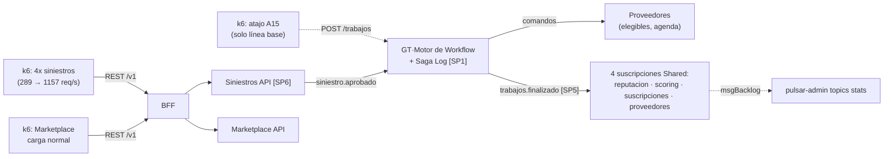
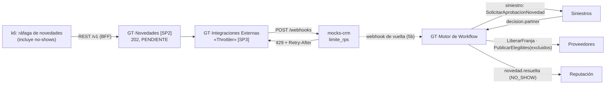
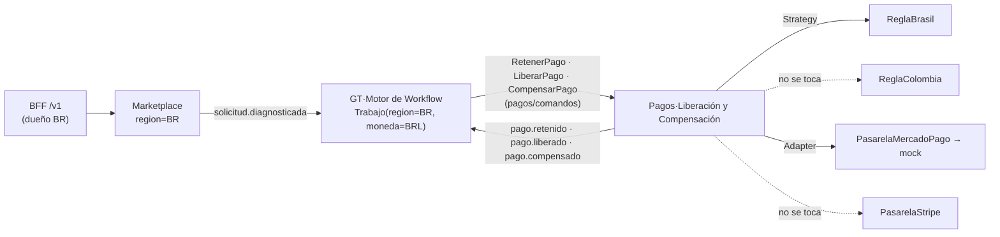

# Plan de experimentos de la Entrega 5: los escenarios dentro del journey

Hogar de los Alpes (HdA), MISO 2026-14. Paso 2.1 de `../../contexto/18-guia-paso-a-paso-entrega-5.md`.

| | |
|---|---|
| **Qué es** | Plan de experimento **escrito antes de medir** (hueco 3 de `../../contexto/16-plan-entrega-5.md`): H1, H0, variables, casos, umbrales heredados y amenazas a la validez de cada escenario **dentro del journey** |
| **Experimentos oficiales (A23)** | **JRN-02 / ESC-01** (escalabilidad), **JRN-03 / DISP-02** (disponibilidad), **JRN-04 / MOD-02** (modificabilidad) |
| **Experimentos de no regresión (plan corto)** | JRN-01 / DISP-03, JRN-05 / MOD-03 y el **caso de saga compensada** (§11.1 y §11.2 del 15) |
| **Formato** | El de `../proveedores/plan.md` (plan de DISP-03, Entrega 3): escenario, objetivo, hipótesis, tácticas, diseño, variables, casos, criterios, amenazas. Se agrega por experimento la lista **"Depende de (Etapa 1)"** |
| **Fuentes de los umbrales** | `../../contexto/escenarios_calidad.md` (medida de la respuesta de cada escenario, **sin bajar ninguna**, Regla 3 de `../../contexto/REGLAS-DURAS-rubrica-entrega-3.md`) + medidas de journey de `../../contexto/15-arquitectura-entrega-5.md` §11 y §11.1 |
| **Contrato de mensajes** | `../asyncapi/hda-asyncapi.yaml` (tópicos, comandos en `persistent://hda/<destino>/comandos`, campos). Donde el AsyncAPI y el 15 no coinciden, se dice en §9 "Pendientes para el equipo" |
| **Rúbrica** | `../../contexto/REGLAS-DURAS-rubrica-entrega-5.md`, ítems 7 (resultados cuantitativos y cualitativos) y 8 (conclusión por hipótesis); ítems 2 y 3 para el caso de saga compensada |
| **Estado del plan** | Borrador para revisión de `validador-hipotesis` (paso 2.1). **No se ha corrido nada.** La Etapa 1 no está cerrada: cada experimento dice qué pasos la bloquean |
| **Quién hace qué** | `experimento-runner` corre y guarda datos crudos en `implementacion/journey/resultados/` (paso 2.5); `validador-hipotesis` da el veredicto (paso 2.6). Este documento **no da veredictos** |

---

## 0. Reglas comunes a todos los experimentos

### 0.1 Entrada de los estímulos

- **Todo estímulo de negocio entra por el BFF** (A25, `implementacion/bff/`), con el header `X-Correlation-Id`.
  La única excepción es la **línea base de ESC-01**, que usa el atajo `POST /trabajos` de Gestión de Trabajos
  (A15, `HABILITAR_ATAJO_CARGA=true` solo durante esa corrida) para ser comparable con
  `../RESULTADOS-ESCALABILIDAD-GCP.md`.
- La **inyección de fallas** no es un estímulo de negocio: se hace directo contra los mocks con
  `POST /_control/config` (`mocks-crm`: `limite_rps`; `mocks-pagos` y los mocks de verificación de
  `proveedores/app/mocks`: `modo` = `ok` | `error_parcial` | `caido` | `timeout`).
- Las rutas exactas del BFF por capacidad (registrar proveedor, pedir trabajo, aprobar siniestro, aprobar
  paso, reportar novedad, completar sub-trabajo, calificar, contratar suscripción) **todavía no están fijadas
  en el 15** (solo `GET /v1/sagas/{id}`). Este plan nombra la **capacidad**; la ruta se copia aquí desde el
  OpenAPI del BFF (`bff/openapi/openapi.json`) cuando cierre el paso 1.10. Ver P-09.

### 0.2 Fuentes de evidencia y cómo se mide cada cosa

| Fuente | Qué se saca | Cómo |
|---|---|---|
| **k6** (`implementacion/k6/`) | Latencia de aceptación (p95, p99), tasa de aceptación, req/s por escenario de k6 | `http_req_duration{scenario:…}`, `http_req_failed{scenario:…}`; exporte `handleSummary` + JSON por request con timestamp (igual que `esc-01.js`) |
| **Cloud Logging** (campos de §13 del 15) | Recorrido por `correlation_id`, comandos, eventos, compensaciones, tiempos entre mensajes | Filtros sobre `jsonPayload.servicio`, `jsonPayload.modulo`, `jsonPayload.agregado`, `jsonPayload.correlation_id` (= `trabajo_id`), `jsonPayload.saga_id`, `jsonPayload.paso_saga`, `jsonPayload.tipo_comunicacion` (`intra_modulo` \| `entre_modulos_sync` \| `entre_modulos_async` \| `entre_servicios_comando` \| `entre_servicios_evento` \| `rest_bff` \| `externo`), `jsonPayload.tipo_mensaje` (`comando` \| `consulta` \| `evento_de_dominio` \| `evento_de_integracion` \| `compensacion`) y `jsonPayload.evento` (nombre de la línea: `mensaje_publicado`, `mensaje_recibido`, `novedad_entregada`, …). Las consultas quedan en `implementacion/QUERIES-GCP-JOURNEYS.md` (paso 2.3) |
| **Saga Log** (BD de GT, §7.1 del 15) | Estado final por saga, secuencia de pasos, duración por paso, pasos expirados, compensaciones | `saga_instancia(saga_id, trabajo_id, origen, estado, paso_actual, iniciada_en, actualizada_en)` y `saga_log(id, saga_id, secuencia, paso, tipo, servicio, mensaje, id_mensaje, payload, ocurrido_en)` con `tipo` ∈ `COMANDO_ENVIADO` \| `EVENTO_RECIBIDO` \| `COMPENSACION_ENVIADA` \| `PASO_EXPIRADO` \| `SAGA_COMPLETADA` \| `SAGA_COMPENSADA`. Consultas en `../gestion-de-trabajos/sql/consultas-saga-log.sql`, conexión por Cloud SQL Auth Proxy (paso 2.4). **Hoy el SQL del repo usa otros nombres de columna y estado (`id`, `timestamp`, `FALLIDA`)**: se mide contra el esquema del 15 (ver P-11) |
| **Pulsar** (VM `pulsar-infra/gcp`) | Backlog por suscripción, mensajes en DLQ | `pulsar-admin topics stats <tópico>` → `subscriptions.<suscripción>.msgBacklog`, muestreado cada 10 s durante la corrida; métricas del broker en `:8080/metrics` (`pulsar_subscription_back_log`) si el panel de Grafana está listo; DLQ = tópico `<tópico>-<suscripción>-DLQ` (CONVENCIONES §3) |
| **BD de cada servicio** | Estado final de agregados; idempotencia | Proveedores (`AgendaTecnico`/`Reserva`), Pagos (`Pago`), GT (`Trabajo`, `Novedad`); tabla `eventos_procesados(id_evento, tipo, recibido_en)` de cada consumidor (CONVENCIONES §3) |
| **Git y CI** (solo MOD-02/MOD-03) | Archivos tocados, pipelines ejecutados, suites | `git diff -M --stat`, historial del PR, ejecución de `.github/workflows/pr-quality-gate.yml` |

Definiciones operativas usadas en varios experimentos:

- **Aceptada** = respuesta 2xx del BFF (202 donde el flujo es asíncrono) dentro del timeout de k6.
- **Lag de un consumidor, en segundos** = `msgBacklog` de su suscripción ÷ tasa de producción del tópico al
  ritmo pico (es la forma en que ESC-01 lo define: "≤ 120 s de tráfico al ritmo pico").
- **Latencia de procesamiento por mensaje** = instante del ack del consumidor − `publish_time` del mensaje.
  Hoy CONVENCIONES §3 solo exige `mensaje_publicado` y `mensaje_recibido`; para medir hasta el ack hace falta
  una línea de log al confirmar (ver P-12). Mientras no exista, se reporta `mensaje_recibido − mensaje_publicado`
  (unidos por `message_id`) y se marca como **cota inferior**, no como la medida heredada.
- **Mensaje perdido** = `id_evento` con `mensaje_publicado` en el tópico que no aparece ni en
  `eventos_procesados` del consumidor ni en su DLQ al terminar el drenado.
- **Niveles de log:** las corridas se hacen con `LOG_DETALLE` en modo completo o, si el volumen de logs lo
  impide, verificando antes que ninguna línea usada en una medida se emite con `detalle=True`
  (`logging_utils.log_evento` las omite con `LOG_DETALLE=minimo`).

### 0.3 Manifiesto de cada corrida (variables controladas comunes)

Cada corrida guarda en `resultados/<jrn>/<fecha>-<caso>/manifiesto.json`: commit (`git rev-parse HEAD`),
proyecto y región GCP (`southamerica-east1`), por servicio `cpu`, `memory`, `min/max_instance_count`,
`containerConcurrency`, pool de BD, tier de Cloud SQL, número de particiones de `trabajos.finalizado`,
configuración de cada mock (`GET /_control/estado`), datos sembrados (proveedores habilitados por categoría y
zona, partners y sus reglas), versión del script k6 y hora de inicio y fin. Sin manifiesto la corrida no se
entrega a `validador-hipotesis`.

### 0.4 Repeticiones

ESC-01 mostró en la Entrega 4 **variación entre corridas casi tan grande como el efecto medido**
(`RESULTADOS-ESCALABILIDAD-GCP.md` §3 punto 6). Por eso: **mínimo 3 corridas** por caso de carga (JRN-02,
JRN-03), reportando las 3, no la mejor; los casos funcionales (JRN-04, JRN-01, JRN-05, saga compensada)
se repiten **N = 30** veces por caso (mismo orden de magnitud que el plan de DISP-03), porque sus umbrales
son del 100 % o del 0 %.

---

## 1. JRN-02 — ESC-01: pico 4x de siniestros por granizada

### 1.1 Escenario bajo prueba

Tabla ATAM de `escenarios_calidad.md` (Escalabilidad, ESC-01), resumida sin cambiar las medidas:

| Campo | Contenido |
|---|---|
| **Fuente** | Evento climático estacional |
| **Estímulo** | Pico de hasta 4x en el volumen de siniestros en 48 h; +25M requests/día en crecimiento hacia 100M+ |
| **Artefacto** | Gestión de Trabajos + colas de eventos. En el journey: API de Siniestros (**SP6**), API de GT (**SP1**) y bus Pulsar con el fan-out de `TrabajoFinalizado` (**SP5**) (nota de `05-vista-modulo.puml`) |
| **Ambiente** | Operación normal / pico estacional |
| **Respuesta** | Procesa de forma asíncrona sin bloquear escritura en BD ni afectar otros dominios |
| **Medida de la respuesta** | Ver §1.6 (umbrales, uno por uno, con su fuente) |

Qué agrega el journey (§5.3 del 15): el pico entra por el **canal real** (Siniestros, vía BFF) y recorre la
saga (pasos 1-3, sin retención porque es siniestro, 5 y 6 con `FacturarAPartner`), y `TrabajoFinalizado`
alimenta a **4 consumidores reales**, cada uno con su suscripción.

### 1.2 Objetivo y pregunta

> Con 4x de siniestros entrando por el BFF y la API de Siniestros, mientras Marketplace recibe su carga normal,
> **¿la plataforma acepta en < 2 s p95 y ≥ 99,9 %, sin mover más de 5 % la latencia de aceptación de
> Marketplace, y los 4 consumidores de `trabajos.finalizado` siguen el ritmo (lag ≤ 120 s, drenado ≤ 15 min,
> p95 < 2 s, 0 perdidos), sin listas de elegibles vacías ni dobles reservas de franja?**

### 1.3 Hipótesis

- **H1:** La aceptación asíncrona en el canal (202 + evento `SiniestroAprobado`), la saga orquestada por
  comandos en Pulsar, el evento `TrabajoFinalizado` con carga de estado y **una suscripción Shared por
  consumidor**, junto con réplicas sin estado en Cloud Run (BFF, Siniestros, GT y workers), sostienen el pico
  4x cumpliendo **todas** las medidas de §1.6.
- **H0:** La cadena del journey (salto adicional del BFF, canal Siniestros, escrituras del Saga Log en la misma
  BD de GT que el ciclo de vida, reserva atómica en Proveedores) degrada la aceptación por encima de 2 s p95
  o por debajo de 99,9 %, **o** mueve más de 5 % la latencia de Marketplace, **o** hace que al menos uno de los
  4 consumidores incumpla lag, drenado, latencia o pérdida, **o** produce una lista vacía o una doble reserva.

H1 se rechaza con **una sola** medida incumplida en la mediana de las 3 corridas del caso, o con cualquier
mensaje perdido o doble reserva en cualquier corrida. El umbral no se ajusta para que pase (§11 del 15).

**Antecedente que se declara antes de medir:** la mejor corrida de la Entrega 4 con el atajo fue p95 = 5,19 s
con 0 % de fallo (`RESULTADOS-ESCALABILIDAD-GCP.md` §1.1.1, corridas 9-10). La línea base parte fuera del
umbral de latencia; no se esconde.

### 1.4 Tácticas bajo prueba

| Táctica (catálogo de escalabilidad y rendimiento) | Dónde vive | Qué se espera ver |
|---|---|---|
| Aceptación asíncrona (introducir concurrencia) | API de Siniestros (SP6) → `SiniestroAprobado` | 202 sin esperar a la saga |
| Publish-subscribe con **suscripción Shared propia por consumidor** | `persistent://hda/gestion-trabajos/trabajos.finalizado` (SP5): `reputacion-`, `scoring-`, `suscripciones-`, `proveedores-`, `siniestros-`, `pagos-trabajos.finalizado` | El lag de un consumidor no frena a otro |
| Evento de integración con carga de estado | `TrabajoFinalizado` (§7.2 del 15) | 0 llamadas de vuelta a GT durante el pico |
| Réplicas sin estado con auto-scaling | Cloud Run (BFF, Siniestros, GT API, workers) | Instancias suben con la carga, sin errores de "no available instance" |
| Orquestación con Saga Log en la BD del coordinador (A22) | GT·Motor de Workflow | Costo medible: duración por paso y pasos expirados bajo pico |
| Reserva atómica de franja (A14) + nunca lista vacía (A12) | Proveedores·Agenda y Elegibilidad | 0 dobles reservas, 0 listas vacías |

### 1.5 Diseño

Para que un trabajo de siniestro llegue a `FINALIZADO` hacen falta pasos de actor (partner aprueba al
proveedor, proveedor completa el sub-trabajo). En el experimento **los automatiza k6 por el BFF** sobre los
trabajos creados, con un escenario de k6 aparte. Ese script todavía no existe (`esc-01.js` solo pega al atajo):
ver P-13.

**Compresión temporal (heredada de `k6/esc-01.js`):** las 48 h del pico se comprimen a 12 min (2 min base,
3 min rampa, 5 min sostenido en pico, 2 min bajada; ≈ 240x). **La tasa no se comprime:** 289 req/s base y
1157 req/s pico (25M y 100M req/día, `k6/lib/config.js`). El piso de volumen de `trabajos.finalizado` que fija
ESC-01 es 36.000 × 4 ≈ 144.000/día (≈ 1,67 msg/s promedio); cualquier tasa de finalización por encima de ese
piso cumple la Regla 3, y la línea base con el atajo lo supera ampliamente.

### 1.6 Variables

**Independientes (lo que se controla o inyecta):**

| Variable | Niveles |
|---|---|
| Tasa de arribo de siniestros | Base 289 req/s → pico 1157 req/s (perfil de 12 min de `esc-01.js`) |
| Camino de entrada | (a) Journey: BFF → Siniestros → saga; (b) Línea base: atajo `POST /trabajos` en GT (A15), que crea y finaliza de una vez |
| Carga concurrente de Marketplace | Ausente (medición de referencia) / presente a tasa normal constante durante toda la corrida |
| Concurrencia sobre una misma franja | Selecciones simultáneas del mismo `tecnico_id` + `franja` (caso CP-E5) |
| Oferta de proveedores | Capacidad holgada / capacidad al límite (A12: `CAPACIDAD_POR_TECNICO=3`, `MINIMO_ELEGIBLES=3`) |

**Dependientes (lo que se mide) y su umbral:**

| # | Variable | Umbral | Fuente del umbral | Cómo se mide |
|---|---|---|---|---|
| E-1 | Latencia de aceptación p95 del estímulo | **< 2 s en pico** | `escenarios_calidad.md` ESC-01 | k6 `http_req_duration{scenario:pico_siniestros}` en la ventana de pico |
| E-2 | Solicitudes aceptadas en pico | **≥ 99,9 %** | ESC-01 | k6 `http_req_failed` < 0,001 en la ventana de pico |
| E-3 | Variación de la latencia de aceptación de Marketplace (dominio ajeno al pico) | **< 5 %** (p95 durante el pico vs. p95 sin pico) | ESC-01 | k6 `http_req_duration{scenario:marketplace_normal}` por ventana. Ver P-14: en E5 Siniestros ya no es "ajeno al pico" |
| E-4 | Lag de **cada uno** de los 4 consumidores de `trabajos.finalizado` | **≤ 120 s** de tráfico al ritmo pico, en todo momento del pico | ESC-01 (definido para Proveedores y Reputación) + 15 §11 JRN-02 (a): aplica a los 4 | `msgBacklog` por suscripción cada 10 s ÷ tasa pico |
| E-5 | Tiempo de drenado de cada suscripción | **≤ 15 min** desde que la producción vuelve a la base | ESC-01 | Primer muestreo con `msgBacklog` en nivel pre-pico |
| E-6 | Latencia de procesamiento por mensaje, por consumidor | **p95 < 2 s, p99 < 5 s** | ESC-01 | ack − `publish_time` (P-12); mientras tanto, cota inferior por `message_id` |
| E-7 | Mensajes perdidos por consumidor | **0 %** (lo no procesable queda en su DLQ) | ESC-01 | Publicados vs. `eventos_procesados` + DLQ (§0.2) |
| E-8 | Trabajos sin elegibles durante el pico | **0** | 15 §11 JRN-02 (b), A12 | `ElegiblesPublicados` con `elegibles` vacío = 0, y 0 sagas con `PASO_EXPIRADO` en el paso 2 por falta de lista |
| E-9 | Dobles reservas de la misma franja de un técnico | **0** | 15 §11 JRN-02 (c), A14 | SQL en la BD de Proveedores: reservas activas agrupadas por `tecnico_id`, fecha y bloque con `count > 1` = 0; y por franja, a lo sumo un `AgendaConfirmada` |
| E-10 | Sagas por minuto, duración por paso, pasos expirados | **Sin umbral heredado**: se reporta (descriptivo) | 15 §11.1 (evidencia) | Saga Log: diferencia de `ocurrido_en` entre `COMANDO_ENVIADO` y `EVENTO_RECIBIDO` por `paso`; conteo de `PASO_EXPIRADO` |
| E-11 | Llamadas de vuelta a GT desde consumidores durante el pico | Sin umbral heredado; se espera 0 (evidencia de la táctica de carga de estado) | ESC-01 (rationale) | Logs `rest_bff`/`externo` hacia GT desde los 4 consumidores |

**Controladas:** las del manifiesto (§0.3) y además: el runner de k6 corre en la VM `k6-runner-poc-vm` de la
misma región (no desde una red doméstica: el NAT saturó en la Entrega 4); calentamiento de 2 min antes de medir;
mocks en modo `ok`; reglas de partner que no bloquean (aprobación de proveedor automatizada por k6); tamaño del
payload de `TrabajoFinalizado` registrado (`mensaje_publicado.tamano_bytes`, ~191 bytes en la Entrega 4 más
`origen` y `origen_id`).

### 1.7 Casos de prueba

| # | Caso | Estímulo | Resultado esperado (H1) | Medidas |
|---|---|---|---|---|
| CP-E1 | Referencia de Marketplace sin pico | Solo Marketplace a tasa normal, 12 min | p95 de aceptación de Marketplace estable | Base de E-3 |
| CP-E2 | **Línea base con atajo (A15)** | k6 4x contra `POST /trabajos` de GT, los 4 consumidores activos | Comparable con las corridas 9-10 de la Entrega 4 | E-1, E-2, E-4..E-7 |
| CP-E3 | **Pico en el journey** | k6 4x de siniestros por el BFF + Marketplace normal + escenario k6 que aprueba y completa los trabajos creados | Todas las medidas en umbral | E-1..E-11 |
| CP-E4 | Drenado post-pico | Continuación de CP-E2 y CP-E3 al volver a la base | Cada suscripción vuelve al nivel pre-pico ≤ 15 min | E-5, E-7 |
| CP-E5 | Carrera por la misma franja | Durante CP-E3, 50 selecciones simultáneas del mismo técnico y franja desde trabajos distintos | Exactamente 1 `AgendaConfirmada` y 49 `AgendaRechazada`; los 49 trabajos vuelven al paso 2 | E-9 |
| CP-E6 | Oferta al límite | Durante CP-E3 con capacidad al límite (pocos técnicos por categoría y zona) | Ninguna lista vacía: se agregan los que están en su límite, por menor carga (A12) | E-8 |

La diferencia CP-E3 − CP-E2 estima el **costo del journey** (BFF + canal + saga) sobre la aceptación y el
fan-out. No es una diferencia limpia (ver amenazas).

### 1.8 Criterios de éxito o fracaso

- **Apoya H1** si, en la mediana de 3 corridas de CP-E3, E-1..E-9 están en umbral, y en ninguna corrida hay
  mensajes perdidos (E-7) ni dobles reservas (E-9).
- **Apoya H0** con cualquier incumplimiento de E-1..E-9. Si CP-E2 incumple y CP-E3 también, el hallazgo es de
  capacidad de GT (ya conocido); si solo CP-E3 incumple, es costo del journey. Las dos lecturas se reportan.
- E-10 y E-11 no deciden el veredicto: explican el resultado.

### 1.9 Amenazas a la validez

| Tipo | Amenaza | Mitigación |
|---|---|---|
| Interna | Variación entre corridas no controlada (Entrega 4, §3 punto 6 de `RESULTADOS-ESCALABILIDAD-GCP.md`) | 3 corridas por caso, manifiesto, instancia de Cloud SQL estable ≥ 10 min antes de correr |
| Interna | La diferencia CP-E3 − CP-E2 mezcla tres causas (salto del BFF, canal Siniestros, saga) | Se reporta como costo agregado del journey; la duración por paso del Saga Log (E-10) y la latencia por servicio en Grafana permiten repartirlo, sin afirmar causalidad fina |
| Interna | Los pasos de actor los automatiza k6 sin pausa humana: la tasa de finalización es artificialmente alta y pareja | Se declara; favorece estresar el fan-out, no la aceptación |
| Constructo | Latencia de procesamiento medida hasta `mensaje_recibido` y no hasta el ack mientras falte P-12 | Se reporta como cota inferior, no como cumplimiento de E-6 |
| Constructo | "Dominio ajeno al pico" era Siniestros, Marketplace o Suscripciones en ESC-01; en E5 Siniestros es la fuente del pico y Suscripciones consume `trabajos.finalizado` | Se mide Marketplace (el único que sigue ajeno); ver P-14 |
| Externa | Compresión 48 h → 12 min: no cubre fugas de memoria, rotación de conexiones ni costo de 48 h de logs | Se declara; el mecanismo, no la resistencia de 48 h, es lo que se valida |
| Externa | Un solo broker Pulsar en VM y cuota de 20 vCPU por región: la configuración que mejor funcionó en la Entrega 4 (GT con `cpu=2`, `min_instance_count=10`) ya usa casi toda la cuota, y ahora hay 9 servicios, el BFF y los workers | Registrar el reparto de vCPU en el manifiesto; si la cuota obliga a bajar GT, se dice y no se compara con la Entrega 4 sin esa salvedad (P-18) |
| Externa | Mocks en lugar de externos reales | Sin efecto en ESC-01 (mocks en `ok`); se declara |
| Conclusión | 3 corridas no dan significancia estadística | Se reportan las 3 y su rango, no un promedio solo |

### 1.10 Depende de (Etapa 1)

| Paso | Qué hace falta para JRN-02 |
|---|---|
| 1.1 | Campos de log de §13, esquemas en el registry, worker con `/salud` |
| **1.2** | Saga (pasos 1-3, 5, 6), Saga Log con el esquema del 15, `POST /trabajos` detrás de `HABILITAR_ATAJO_CARGA` (CP-E2) |
| **1.3** | `PublicarElegibles` con A12 (nunca vacía), `ReservarFranja` atómica (A14), consumidor `proveedores-trabajos.finalizado` |

| 1.5 | Worker de Reputación desplegado (`reputacion-trabajos.finalizado`) |
| 1.6 | Marketplace con su ruta de solicitud (carga normal de CP-E1/CP-E3) |
| **1.7** | Siniestros: API de aprobación de siniestro, `AprobarPaso`, `FacturarAPartner` (+ `FacturaEmitida`, P-07) |
| 1.8 | Consumidor `suscripciones-trabajos.finalizado` |
| 1.9 | Consumidor `scoring-trabajos.finalizado` |
| **1.10** | Rutas del BFF para siniestro, aprobación, completar sub-trabajo y Marketplace (P-09) |
| 1.11 | Journey local en verde antes de gastar GCP |
| Etapa 2 | 2.2 despliegue, 2.3 queries y panel de backlog, script k6 del journey (P-13) |

---

## 2. JRN-03 — DISP-02: novedades en ráfaga con el CRM limitado

### 2.1 Escenario bajo prueba

| Campo | Contenido (`escenarios_calidad.md`, Disponibilidad, DISP-02) |
|---|---|
| **Fuente** | Pico estacional de granizada |
| **Estímulo** | Novedades intenta publicar **miles de webhooks por segundo** hacia Gestión de Agentes (CRM SaaS), que impone rate limiting |
| **Artefacto** | Sidecar/Throttler de salida de GT hacia el CRM. En la vista de módulos: **SP2** Novedades y **SP3** Integraciones Externas «Throttler» |
| **Ambiente** | Operación en pico estacional (4x) |
| **Respuesta** | Dosifica el envío respetando el límite, encola el excedente para reintento, sin bloquear el hilo principal de GT |
| **Medida de la respuesta** | Ver §2.6 |

Qué agrega el journey (§5.2 y §5.3 del 15): la novedad **nace del ciclo de vida del Trabajo** y la respuesta
**cambia el Trabajo**: un no-show libera la franja y vuelve al paso 2 con `excluidos`; en siniestros, la
resolución espera `DecisionPartner(APROBADA)` (A11); y la reputación del proveedor que falló baja (A10).

### 2.2 Objetivo y pregunta

> Durante el pico de JRN-02, con proveedores reportando novedades en ráfaga y el CRM limitando la tasa,
> **¿GT sigue disponible (≥ 99,9 %), no pierde novedades por rate limiting (≥ 99,9 %), entrega ≥ 99 % de los
> webhooks en < 15 min y el 100 % en < 1 h, y además reasigna el 100 % de los no-shows sin aplicar ninguna
> resolución de siniestro sin aprobación del partner?**

### 2.3 Hipótesis

- **H1:** El Throttler (cola acotada + token bucket por instancia + `Retry-After` / backoff con jitter + estados
  `PENDIENTE` → `ENTREGADA` | `AGOTADA`), con la novedad aceptada en 202 y separada del ciclo de vida
  (agregado `Novedad` propio, A17), mantiene las medidas de DISP-02 **mientras** la saga aplica la rama de
  no-show (`LiberarFranja` + `PublicarElegibles` con `excluidos`) y la de aprobación del partner
  (`SolicitarAprobacionNovedad` → `DecisionPartner`) sin error.
- **H0:** Con el CRM limitado y el pico de JRN-02 encima, la cola del Throttler se llena y traslada la presión
  a la aceptación de novedades o al resto de GT (disponibilidad < 99,9 %), o se pierden o agotan novedades por
  rate limiting, o la entrega supera 15 min / 1 h, o algún no-show queda sin reasignar, o se aplica una
  resolución de siniestro sin `DecisionPartner(APROBADA)`.

### 2.4 Tácticas bajo prueba

| Táctica | Dónde vive | Qué se espera ver |
|---|---|---|
| Desacople por respuesta asíncrona (202) | GT·Novedades (SP2) | Aceptación de novedad sin esperar al CRM |
| Control de tasa (token bucket) sobre cola acotada, con backpressure | GT·Integraciones Externas (SP3), `CRM_LIMITE_RPS`, `THROTTLER_COLA_TAMANO` | Tasa hacia el CRM ≤ límite × instancias |
| Reintento con `Retry-After` o backoff exponencial con jitter, acotado | SP3, `THROTTLER_MAX_REINTENTOS` | 429 absorbidos, `AGOTADA` con motivo si se agota |
| Compensación parcial de la saga (no-show) | GT·Motor → Proveedores `LiberarFranja`, `PublicarElegibles` con `excluidos` | `COMPENSACION_ENVIADA` + nuevo ciclo del paso 2 |
| Aprobación externa antes de aplicar (A11) | Siniestros·Orquestación de Partner | `DecisionPartner` precede a toda resolución en siniestros |

Parámetros sensibles (de la fila "Puntos de sensibilidad" de DISP-02): `CRM_LIMITE_RPS`,
`THROTTLER_COLA_TAMANO`, `THROTTLER_MAX_REINTENTOS`, `THROTTLER_BACKOFF_BASE_S` / `_MAX_S` y el número de
instancias de GT (el bucket es por instancia). Todos van al manifiesto.

### 2.5 Diseño

La vuelta del CRM (§5.2 paso 5b: `CRM ─webhook→ GT·Integraciones Externas`) **no la emite hoy `mocks-crm`**
(solo recibe `POST /webhooks` y responde 429). Cómo entra la resolución del agente en el experimento queda
en P-10.

**Sin compresión temporal:** los umbrales de 15 min y 1 h se miden en tiempo de pared, como en la Entrega 4.

**Volumen (Regla 3).** El estímulo dice "miles de webhooks por segundo". La corrida de la Entrega 4 fue 2.000
novedades con el CRM a 20 rps (`RESULTADOS-DISP02.md`), que sirve para comparar pero no alcanza el volumen del
estímulo. Se proponen dos niveles (P-17 para confirmar los números):

- **Comparable:** 2.000 novedades en ráfaga, CRM a 20 rps (igual que la Entrega 4).
- **Enunciado:** ≥ 1.000 novedades/s sostenidas 60 s (≥ 60.000 novedades) durante el pico de JRN-02. Aritmética
  que se declara antes de medir: para entregar el 99 % en 15 min el CRM debe aceptar ≥ 59.400 / 900 s ≈ 66 rps;
  con 20 rps el 99 % en 15 min es **imposible por capacidad del externo**, no por diseño. Por eso el límite del
  CRM en este nivel es una variable (propuesta: 100 rps) y el resultado se lee junto con esa aritmética. Con
  `THROTTLER_COLA_TAMANO=10.000` por instancia, 60.000 novedades exigen ≥ 6 instancias de GT o activan el
  backpressure: es justo el riesgo (4) documentado en DISP-02 y se quiere observar.

### 2.6 Variables

**Independientes:**

| Variable | Niveles |
|---|---|
| Volumen y tasa de la ráfaga | Comparable (2.000 en ráfaga) / enunciado (≥ 1.000/s por 60 s) |
| Límite del CRM (`POST /_control/config` de `mocks-crm`) | 20 rps / 100 rps (propuesto) / 1 rps (saturado, CP-D6) |
| Pico de JRN-02 concurrente | No / sí |
| Mezcla de `tipo_novedad` | `NO_SHOW` (≥ 10 % de la ráfaga), `GARANTIA`, `OTRA` (enum del AsyncAPI) |
| Origen del trabajo | `MARKETPLACE` / `SINIESTRO` |
| Regla del partner (siniestros) | Sin aprobación (automática) / con aprobación → `AprobarPaso` / `RechazarPaso` |

**Dependientes y umbrales:**

| # | Variable | Umbral | Fuente | Cómo se mide |
|---|---|---|---|---|
| D-1 | Trabajos sin pérdida por rate limiting | **≥ 99,9 %** (dentro de la capacidad configurada de la cola) | `escenarios_calidad.md` DISP-02 | `ENTREGADA` / novedades registradas al terminar; `AGOTADA` con motivo 429 y novedades nunca persistidas (5xx en el BFF) cuentan como pérdida |
| D-2 | Webhooks entregados en < 15 min | **≥ 99 %** | DISP-02 | Por novedad: `novedad_entregada` − alta de la novedad (logs unidos por `novedad_id`, o columnas de la BD de GT) |
| D-3 | Webhooks entregados en < 1 h | **100 %** | DISP-02 | Igual que D-2 |
| D-4 | Disponibilidad de GT independiente del CRM | **≥ 99,9 %** | DISP-02 | Sondeo de `/salud` de GT cada 1 s **y** tasa de éxito de las rutas del BFF que no son novedades (aceptación de JRN-02, `GET /v1/sagas/{id}`) durante la ráfaga |
| D-5 | No-shows reasignados a otro proveedor elegible con franja libre | **100 %** | 15 §11 JRN-03 (a) | Por `trabajo_id` con `NovedadResuelta(NO_SHOW)`: existe después un `AgendaConfirmada` con `proveedor_id` distinto y el anterior en `excluidos`. Denominador: no-shows de Marketplace + no-shows de siniestro con `DecisionPartner(APROBADA)` |
| D-6 | Resoluciones de siniestro aplicadas sin aprobación | **0** | 15 §11 JRN-03 (b), A11 | Saga Log: toda `COMPENSACION_ENVIADA` / `COMANDO_ENVIADO` de la rama novedad en un trabajo `origen = SINIESTRO` tiene antes un `EVENTO_RECIBIDO` `DecisionPartner` con `decision = APROBADA` y el mismo `novedad_id`; con `RECHAZADA` el Trabajo no cambia de estado |
| D-7 | Reputación del proveedor que falló | **Baja en el 100 %** de los proveedores con no-show | 15 §11 JRN-03 (c), A10 | `ReputacionPublicada.tasa_cumplimiento` y `reputacion` posteriores < anteriores para cada `proveedor_id` afectado |
| D-8 | 429 del CRM, profundidad de cola, tasa efectiva hacia el CRM, `AGOTADA` | Sin umbral; descriptivo | DISP-02 (riesgos 2 y 4) | `crm_webhook_rechazado_429`, `crm_webhook_aceptado`, `novedad_reintento_programado`, `novedad_agotada` |
| D-9 | Latencia de aceptación de novedades durante la ráfaga | Sin umbral heredado; descriptivo (evidencia de backpressure) | DISP-02 (riesgo 4) | k6 `http_req_duration{scenario:rafaga_novedades}` |

**Controladas:** manifiesto (§0.3), parámetros del Throttler, número de instancias de GT fijado por caso
(`min = max`) para que el bucket por instancia sea conocido, semilla de datos (trabajos en `ASIGNADO` /
`EN_CURSO` listos para recibir no-shows, reglas de partner sembradas).

### 2.7 Casos de prueba

| # | Caso | Estímulo | Resultado esperado (H1) | Medidas |
|---|---|---|---|---|
| CP-D1 | Ráfaga comparable, sin pico | 2.000 novedades por el BFF, CRM a 20 rps | Igual o mejor que la Entrega 4 (2000/2000 `ENTREGADA`) | D-1..D-4, D-8, D-9 |
| CP-D2 | **Ráfaga del enunciado durante el pico** | ≥ 1.000 novedades/s por 60 s durante CP-E3 de JRN-02, CRM al límite propuesto | Medidas en umbral, o hallazgo de capacidad leído con la aritmética de §2.5 | D-1..D-9 |
| CP-D3 | No-show en Marketplace | N = 30 no-shows | Franja liberada (`AgendaLiberada`), nueva lista sin el que falló, nueva `AgendaConfirmada` | D-5, D-7 |
| CP-D4 | No-show en siniestro, regla automática | N = 30 | `DecisionPartner(APROBADA, automatica=true)` antes de liberar y reasignar | D-5, D-6 |
| CP-D5 | No-show en siniestro, regla con aprobación | N = 30, mitad `AprobarPaso`, mitad `RechazarPaso` por el BFF | Aprobadas: reasignadas; rechazadas: Trabajo sin cambio de estado | D-5, D-6 |
| CP-D6 | CRM saturado | CRM a 1 rps durante 10 min con ráfaga activa | GT sigue ≥ 99,9 % disponible; la cola crece, no se cae | D-4, D-8, D-9 |
| CP-D7 | Reinicio de una instancia de GT (exploratorio, no decide el veredicto) | Forzar un redeploy a mitad de CP-D1 | Observa el riesgo (1) de DISP-02: la cola en memoria no se reconstruye | D-1 (reportado aparte) |

### 2.8 Criterios de éxito o fracaso

- **Apoya H1** si CP-D1..CP-D6 cumplen D-1..D-7 en la mediana de 3 corridas (casos de carga) o en 30/30
  (casos funcionales), y ninguna corrida tiene una resolución de siniestro sin aprobación (D-6).
- **Apoya H0** con cualquier incumplimiento de D-1..D-7. Si CP-D2 incumple D-2 con un límite de CRM por debajo
  de la aritmética de §2.5, el validador debe decir si es falla del diseño o del externo; el plan pide reportar
  las dos lecturas.
- CP-D7 se informa como hallazgo, no como parte del veredicto.

### 2.9 Amenazas a la validez

| Tipo | Amenaza | Mitigación |
|---|---|---|
| Interna | El pico de JRN-02 y la ráfaga compiten por las mismas instancias de GT: si D-4 cae, no se sabe cuál de los dos la tumbó | Correr CP-D1 sin pico como control; comparar |
| Interna | Bucket por instancia: con auto-scaling la tasa agregada hacia el CRM es N × `CRM_LIMITE_RPS` | Fijar `min = max` instancias en cada caso y reportar N |
| Interna | La resolución del agente la simula el experimento (P-10): el tiempo "agente" no es real | Se declara; no entra en D-2/D-3, que miden la entrega hacia el CRM |
| Constructo | "Sin pérdida por rate limiting" podría leerse contando `AGOTADA` como no perdida (queda persistida) | Se cuenta como pérdida; se reporta también la otra lectura |
| Constructo | `mocks-crm` solo modela rate limiting (sin `caido` ni `timeout`), con ventana deslizante en memoria y 1 sola instancia | Declarado en DISP-02 riesgo (6); el experimento no dice nada de un CRM caído |
| Externa | Límite real del CRM desconocido; 20 y 100 rps son supuestos | Se declara; P-17 |
| Externa | La ráfaga de 60 s no es "un pico de 48 h" | Se declara; mide el mecanismo bajo la tasa del enunciado |
| Conclusión | N = 30 en los casos funcionales da una cota, no una tasa de falla precisa | Se reporta 30/30 o el conteo exacto |

### 2.10 Depende de (Etapa 1)

| Paso | Qué hace falta para JRN-03 |
|---|---|
| 1.1 | Campos de log de §13 |
| **1.2** | Módulos `novedades` e `integraciones_externas` (Throttler + webhook de vuelta del CRM), rama no-show y rama siniestro de la saga (`LiberarFranja`, `PublicarElegibles` con `excluidos`, `SolicitarAprobacionNovedad`), `NovedadRegistrada` y `NovedadResuelta` |
| **1.3** | `LiberarFranja` + `AgendaLiberada`, `PublicarElegibles` respetando `excluidos` |
| 1.5 | Reputación consume `NovedadResuelta(NO_SHOW)` y publica `ReputacionPublicada` (A10) |
| 1.6 | Marketplace re-selecciona tras una lista nueva (CP-D3) |
| **1.7** | Siniestros: `ReglaDeAprobacion`, `SolicitarAprobacionNovedad` → `DecisionPartner`, `AprobarPaso` / `RechazarPaso` |
| **1.10** | Rutas del BFF para reportar novedad y para que el partner apruebe o rechace (P-09); cómo entra la respuesta del agente (P-10) |
| 1.11 | Journey local en verde |
| Otros | JRN-02 corriendo para CP-D2 |

---

## 3. JRN-04 — MOD-02: pago en Brasil y disputa

### 3.1 Escenario bajo prueba

| Campo | Contenido (`escenarios_calidad.md`, Modificabilidad, MOD-02) |
|---|---|
| **Fuente** | Equipo de producto / legal |
| **Estímulo** | Adaptar reglas fiscales, de moneda y regulatorias para el lanzamiento en Brasil sin afectar a los demás países |
| **Artefacto** | Strategy de reglas regionales y Adapter de pasarela. En E5 los dos viven en **Pagos** (módulos *Liberación y Compensación* y *Pasarelas*, A18 y §4 del 15). `escenarios_calidad.md` todavía dice "dentro de Gestión de Trabajos" (P-15) |
| **Ambiente** | Tiempo de diseño y desarrollo, previo al lanzamiento regional |
| **Respuesta** | Tras extender una sola vez `Monto` con `Moneda` y `Trabajo` con país/región, el país nuevo se agrega por configuración/estrategia, sin recompilar ni redesplegar los demás países ni el core |
| **Medida de la respuesta** | Ver §3.6 |

Qué agrega el journey (§5.3 del 15): la región y la moneda **salen del Trabajo**, no de un request a Pagos, y el
pago lo disparan **comandos de la saga** (`RetenerPago`, `LiberarPago`, `CompensarPago`), no un cliente HTTP.

### 3.2 Objetivo y pregunta

> Con `ReglaBrasil` y el adapter de MercadoPago ya agregados, **¿un trabajo de región BR recorre la saga
> completa (retener al confirmar agenda, liberar al finalizar, compensar en disputa) usando la región y la
> moneda del Trabajo, sin que se haya modificado Colombia, Stripe ni el core, con 0 regresiones, y con GT y
> Pagos de acuerdo al final en estado y monto?**

### 3.3 Hipótesis

- **H1:** Strategy regional (`ReglaColombia` / `ReglaBrasil`) + Adapter de pasarela (Stripe / MercadoPago)
  detrás del puerto de Pasarelas, invocados por comandos de la saga que llevan `region` y `moneda` tomadas del
  Trabajo, permiten operar un trabajo BR de punta a punta, incluida la compensación, **sin tocar** los archivos
  de Colombia, Stripe ni el core de GT, con 0 regresiones en las suites y con la saga consistente
  (monto compensado = monto retenido; estado final de GT = estado final de Pagos).
- **H0:** Operar BR dentro del journey obligó a modificar la regla de Colombia, el adapter de Stripe o el core
  de GT, **o** hay alguna regresión, **o** la región o la moneda del pago vienen de otra fuente distinta del
  Trabajo, **o** la saga termina con montos o estados distintos entre GT y Pagos.

### 3.4 Tácticas bajo prueba

| Táctica (catálogo de modificabilidad) | Dónde vive | Evidencia |
|---|---|---|
| Strategy: una clase por región detrás de `ReglaRegional` (anticipar cambios, separar responsabilidades) | Pagos·Liberación y Compensación | Log con `patron="Strategy"` y `regla_regional` (ya existe en `pagos/app/application/commands/pagar_trabajo.py`) |
| Adapter: una pasarela por clase detrás de `IPasarelaDePago` (intermediario / encapsular) | Pagos·Pasarelas | Log con `patron="Adapter"` y `pasarela` |
| Comandos con contrato versionado (A21, A28) | `persistent://hda/pagos/comandos` | `RetenerPago` con `region`, `moneda`, `monto` del Trabajo; `pasarela` opcional (la elige la regla regional) |
| Compensación semántica en la saga (A22) | GT·Motor → `CompensarPago` | `PagoCompensado`, `SAGA_COMPENSADA` |

### 3.5 Diseño

Parte estática (git + CI) y parte dinámica (journey por el BFF). La extensión de BR se hizo en la Entrega 4
(`RESULTADOS-MOD02.md`); aquí se verifica que **sigue siendo cierta dentro del journey** y con el layout por
módulos de la Entrega 5.

### 3.6 Variables

**Independientes:**

| Variable | Niveles |
|---|---|
| Región del trabajo (del request del dueño a Marketplace) | `CO` (control) / `BR` |
| Desenlace | Feliz (`PAGADO`) / disputa después de pagar (`EN_DISPUTA` → `CANCELADO`) |
| Duplicación de mensajes | Sin duplicados / `CompensarPago` reenviado con el mismo `id_comando` y `NovedadResuelta(DISPUTA)` llegando además por su suscripción (P-04) |

**Dependientes y umbrales:**

| # | Variable | Umbral | Fuente | Cómo se mide |
|---|---|---|---|---|
| M-1 | Extensión de modelo `Moneda` / región hecha una sola vez | **Hecha antes del primer país adicional** | `escenarios_calidad.md` MOD-02 | `Monto`/`Moneda` en Pagos y `region` en `Trabajo`; AsyncAPI `Moneda: [COP, BRL]`, `Region: [CO, BR]` |
| M-2 | Esfuerzo del cambio regional | **< 5 días-persona** | MOD-02 | Heredado de la Entrega 4 (commits de `ReglaBrasil` / `PasarelaMercadoPago`, `RESULTADOS-MOD02.md`); se re-cuenta con fechas y autores de esos commits. No se re-mide con un cambio nuevo (ver amenazas y P-16) |
| M-3 | Regresiones | **0** en la suite (gate de release) | MOD-02 | Suites de Pagos y GT + suite del journey (`./test_journeys.py`) en verde, con las cantidades antes y después |
| M-4 | Pipelines de CI/CD disparados para otros países o el core | **0** | MOD-02 | Jobs del CI ejecutados en el PR del cambio regional y stacks redesplegados. Hoy `pr-quality-gate.yml` **no tiene filtros por ruta**: corre toda la matriz en cada PR. Se mide y se reporta tal cual (P-16) |
| M-5 | Archivos de Colombia, Stripe y core modificados | **0** | 15 §11 JRN-04 ("sin modificar Colombia, Stripe ni el core") | `git diff -M --stat <commit previo a BR>..HEAD` sobre la regla de Colombia, el adapter de Stripe y `gestion-de-trabajos/` (solo lo que tocó el cambio de BR). `-M` para que mover archivos al layout por módulos no cuente como cambio de contenido |
| M-6 | Región y moneda del pago tomadas del Trabajo | **100 %** de los pagos | 15 §11 JRN-04 (a) | Por `correlation_id`: `RetenerPago.region`/`moneda` = `region`/`moneda` del Trabajo; `regla_regional = BR` y `pasarela = mercadopago` en `pago.retenido` |
| M-7 | Retención y liberación | **100 %**: `PagoRetenido` tras `AgendaConfirmada`; `PagoLiberado` → `PAGADO` tras `FINALIZADO` | 15 §11 JRN-04 (b), A18 | Orden de `saga_log` (`COMANDO_ENVIADO RetenerPago` después de `EVENTO_RECIBIDO AgendaConfirmada`) |
| M-8 | Disputa compensada | **100 %**: `PagoCompensado` → Trabajo `CANCELADO`, `saga_instancia.estado = COMPENSADA` | 15 §11 JRN-04 (c), §11.2 | Saga Log + estado del Trabajo |
| M-9 | Consistencia de la saga | **Monto compensado = monto retenido = monto liberado** y estado final de GT coherente con el de Pagos en el 100 % | 15 §11 JRN-04 (d), §11.1 | Comparar `monto` de `pago.retenido`, `pago.liberado` y `pago.compensado` por `trabajo_id`; estado del `Trabajo` vs. `EstadoPago` |
| M-10 | Compensaciones por disputa | **Exactamente 1** por trabajo, aun con duplicados | Consecuencia de M-9 (idempotencia, CONVENCIONES §3) | Conteo de `PagoCompensado` por `trabajo_id` y registros en `eventos_procesados` |

**Controladas:** manifiesto, mocks de Stripe y MercadoPago en modo `ok`, mismo monto por trabajo en CO y BR
(solo cambia la región), mismas reglas sembradas.

### 3.7 Casos de prueba

| # | Caso | Estímulo | Resultado esperado (H1) | Medidas |
|---|---|---|---|---|
| CP-M1 | Estático: diff, suites y CI | Revisión de git y del CI sobre el rango del cambio de BR y sobre HEAD | 0 archivos de CO / Stripe / core tocados; suites en verde; conteo de jobs | M-1..M-5 |
| CP-M2 | Control CO | N = 30 journeys `CO` por el BFF hasta `PAGADO` | `ReglaColombia` + Stripe; `PAGADO` | M-6, M-7, M-9 |
| CP-M3 | BR feliz | N = 30 journeys `BR` por el BFF hasta `PAGADO` | `ReglaBrasil` + MercadoPago; `PAGADO` | M-6, M-7, M-9 |
| CP-M4 | **BR con disputa** | N = 30: tras `PAGADO`, el dueño abre una disputa de garantía por el BFF | `EN_DISPUTA` → `CompensarPago` → `PagoCompensado` → `CANCELADO`; saga `COMPENSADA` | M-8, M-9 |
| CP-M5 | Duplicados en la compensación | Sobre CP-M4, reenviar `CompensarPago` con el mismo `id_comando` | Una sola compensación | M-10 |

### 3.8 Criterios de éxito o fracaso

- **Apoya H1** si CP-M1 da 0 en M-4 y M-5, las suites están en verde (M-3), y CP-M2..CP-M5 dan 30/30 en
  M-6..M-10.
- **Apoya H0** con un archivo de CO / Stripe / core modificado por el cambio de BR, una regresión, un pago con
  región o moneda distintas a las del Trabajo, una diferencia de monto o de estado, o una doble compensación.
- **M-4 tiene una lectura dudosa conocida de antemano:** sin filtros por ruta el CI corre todo en cada PR. Si
  M-4 da > 0 por esa razón, el plan pide reportarlo como incumplimiento de la medida heredada (no se baja el
  umbral) y dejar al validador separar "acoplamiento del código" de "configuración del pipeline".

### 3.9 Amenazas a la validez

| Tipo | Amenaza | Mitigación |
|---|---|---|
| Constructo | BR se agregó en la Entrega 4: JRN-04 verifica que la extensión **sigue aislada y funciona en el journey**, no mide de nuevo el acto de extender | Se declara; M-2 queda heredado con su evidencia. Si el equipo quiere medirlo de nuevo, hace falta un cambio regional controlado (P-16) |
| Constructo | La migración al layout por módulos (CONVENCIONES §1) mueve `regla_colombia.py` y `pasarela_stripe.py`: un diff ingenuo diría "modificados" | `git diff -M` y comparación de contenido; se reporta el renombre por separado |
| Constructo | La disputa llega **después** de `PagoLiberado`: §4 del 15 define `EstadoPago` RETENIDO → LIBERADO / COMPENSADO / FALLIDO como alternativas, y "devolver lo retenido" tras liberar no está definido; tampoco si la saga ya `COMPLETADA` pasa a `COMPENSADA` o se abre otra | Se mide lo que el 15 pide (§11.1: retenido = liberado = compensado, `COMPENSADA`) y se reporta el estado real de `saga_instancia` y de `Pago`; P-06 |
| Constructo | Doble camino hacia Pagos en la disputa (`CompensarPago` y suscripción `pagos-novedad.resuelta`) | CP-M5 y M-10 lo miden; P-04 |
| Externa | Solo existen CO y BR (`Region` del AsyncAPI); MOD-02 habla de no afectar México ni Argentina | "No afectar" se verifica solo contra CO; se declara |
| Externa | Pasarelas simuladas | Se declara; el experimento es de modificabilidad, no de integración real |
| Conclusión | N = 30 | Se reporta el conteo exacto |

### 3.10 Depende de (Etapa 1)

| Paso | Qué hace falta para JRN-04 |
|---|---|
| **1.2** | Saga pasos 3-6, rama de disputa (`EN_DISPUTA`, `CompensarPago`), `SAGA_COMPENSADA`, consumidores de `pago.*` |
| 1.3 | `ReservarFranja` → `AgendaConfirmada` |
| **1.4** | Pagos por módulos (`liberacion_compensacion`, `pasarelas`), comandos `RetenerPago`, `LiberarPago`, `CompensarPago`, eventos `pago.retenido`, `pago.liberado`, `pago.compensado`, idempotencia por `id_comando` |
| 1.6 | Marketplace con región en la solicitud |
| **1.10** | Rutas del BFF para pedir el trabajo, completar el sub-trabajo y abrir la disputa (P-09) |
| 1.11 | Journey local en verde |

---

## 4. JRN-01 — DISP-03: Marketplace de punta a punta con la certificadora caída (no regresión)

**Escenario y medidas heredadas** (`escenarios_calidad.md`, DISP-03, y `../proveedores/plan.md`, que sigue
siendo su especificación): disponibilidad del proceso de verificación **≥ 99,9 %**; **100 %** de las
verificaciones fallidas trazables en la DLQ y reprocesables en **< 24 h** (compresión 1 min ≈ 1 h, §5.4 de
`plan.md`; la ventana se valida como < 24 min).

**Medidas de journey** (15 §11 y §11.1): (a) 0 trabajos asignados a un proveedor con verificación pendiente o en
DLQ (no aparece en `ElegiblesPublicados`); (b) tras el reproceso, aparece en la siguiente lista; (c) el trabajo
llega a `PAGADO` y queda calificable; (d) journey visible por `correlation_id`; saga `COMPLETADA`.

- **H1:** La cola de verificación con reintentos, DLQ y reproceso mantiene la verificación disponible y trazable
  con la certificadora caída, y Elegibilidad nunca ofrece a un proveedor no verificado; tras el reproceso, el
  journey de Marketplace termina `PAGADO` con saga `COMPLETADA`.
- **H0:** La caída de la certificadora baja la disponibilidad de la verificación de 99,9 %, pierde alguna
  verificación fallida, o deja pasar a un proveedor no verificado a `ElegiblesPublicados`.
- **Estímulo:** la certificadora en `caido` (`POST /_control/config` de su mock); registro de proveedores por el
  BFF (persona natural y empresa con técnicos); luego reproceso de la DLQ y un pedido del dueño de su
  categoría y zona.
- **Casos:** CP-1..CP-7 de `plan.md` repetidos dentro del journey (no se reescriben: los mismos estímulos y
  métricas) + J1-a: pedido del dueño mientras el proveedor está en DLQ (N = 30: 0 apariciones en
  `ElegiblesPublicados`) + J1-b: reproceso y nuevo pedido (30/30 aparece) + J1-c: journey hasta `PAGADO` y
  calificación.
- **Medición:** query por `proveedor_id` (intentos, DLQ, reproceso) y por `correlation_id` del trabajo. En el
  paso 0 el `correlation_id` es el `proveedor_id` (§7 del 15), así que (d) se mide como dos recorridos unidos
  por `proveedor_id` (P-20).
- **Amenazas (además de las de `plan.md` §10):** A24 mueve la cola de Pub/Sub a Pulsar, pero el AsyncAPI y el
  párrafo de colas internas de §7 del 15 siguen en Pub/Sub (P-08): los números no son comparables con la
  Entrega 3 hasta saber qué transporte corre; el reproceso cruza el límite de la compresión temporal.
- **Depende de (Etapa 1):** **1.3** (Registro, Verificación en Pulsar con DLQ nativa, Elegibilidad, Agenda),
  1.2, 1.4 (retener y liberar), 1.5 (trabajo calificable), 1.6, **1.10** (rutas de registro de proveedor y del
  dueño), 1.11.

## 5. JRN-05 — MOD-03: suscripción mensual (no regresión)

**Medidas heredadas** (`escenarios_calidad.md`, MOD-03): dominio nuevo integrado y desplegado en **< 1 sprint
(2 semanas)**; **0 pull requests** sobre el código de los 8 dominios existentes.

**Medidas de journey** (15 §11): (a) Suscripciones consume `trabajos.finalizado` con **0 cambios en GT** (diff
vacío en `gestion-de-trabajos/` para el consumidor); (b) mismo proveedor en todos los ciclos del mes (A13); (c)
ese proveedor no aparece para la franja ocupada en ningún canal y la segunda reserva recibe `AgendaRechazada`
(A14).

- **H1:** Pub/Sub con suscripción propia deja a Suscripciones consumir `trabajos.finalizado` sin tocar a GT, y
  la reserva recurrente de franja garantiza continuidad del proveedor y exclusión de la franja.
- **H0:** Integrar Suscripciones exigió cambios en GT para consumir `trabajos.finalizado`, o el proveedor cambia
  entre ciclos sin no-show ni deshabilitación, o la misma franja se reserva dos veces.
- **Estímulo:** por el BFF, un cliente contrata aseo los lunes en la mañana por un mes; otro cliente (y un pedido
  de Marketplace) pide la misma franja.
- **Casos:** J5-a diff (`git diff -M` de los commits del consumidor de Suscripciones sobre `gestion-de-trabajos/`
  = vacío; conteo de PRs sobre los 8 dominios); J5-b los ciclos del mes (4-5 `CicloSuscripcion`, mismo
  `proveedor_id`); J5-c la segunda reserva (N = 30 intentos, 30 `AgendaRechazada`).
- **Nota de alcance:** Suscripciones también le **produce** a GT (`CicloSuscripcion`), y GT tuvo que aprender a
  consumirlo. Eso no viola MOD-03, que habla de consumir eventos existentes sin cambiar a sus productores, pero
  el diff se debe acotar a los commits del consumidor para no mezclar las dos cosas.
- **Amenazas:** el mes se tiene que comprimir y el 15 no dice cómo se generan los ciclos siguientes en una
  corrida (P-19); "< 1 sprint" se mide con fechas de commits de un servicio construido con agentes, que no es el
  esfuerzo de un equipo real.
- **Depende de (Etapa 1):** **1.8** (Suscripciones: contrato, ciclos, A13, reserva recurrente A14, consumidor de
  `trabajos.finalizado`), 1.3 (agenda recurrente), 1.2, 1.4 (retención por ciclo), **1.10**, 1.11.

## 6. Caso de saga compensada (ítems 2 y 3 de la rúbrica)

No es un escenario de calidad: es la evidencia de la **transacción con fallos y compensación** y del **Saga
Log** (§11.1 y §11.2 del 15, tramo 4 del video en la guía 18). Corre **dentro de JRN-01** (región CO → Stripe).

- **Estímulo:** `mocks-pagos` (Stripe) en `caido`; el dueño pide y selecciona por el BFF; el coordinador envía
  `RetenerPago`.
- **Recorrido esperado en `saga_log`:** `COMANDO_ENVIADO ReservarFranja` → `EVENTO_RECIBIDO AgendaConfirmada` →
  `COMANDO_ENVIADO RetenerPago` → `EVENTO_RECIBIDO PagoRetencionFallida` → `COMPENSACION_ENVIADA LiberarFranja` →
  `EVENTO_RECIBIDO AgendaLiberada` → `SAGA_COMPENSADA`; Trabajo `CANCELADO`.
- **Variante con plazo:** Stripe en `timeout` para ver `PASO_EXPIRADO` en el paso 4 y la misma compensación. El
  15 dice que cada paso tiene plazo pero no da su valor (P-11).
- **Medidas (sin umbral heredado; funcionales, N = 30 por variante):** 100 % de las sagas terminan
  `COMPENSADA` con la secuencia de arriba; 0 franjas huérfanas (tras la compensación, un `ReservarFranja` de la
  misma franja recibe `AgendaConfirmada`); 0 pagos en `RETENIDO` para esos trabajos; toda línea de la
  compensación con `tipo_mensaje="compensacion"` y `saga_id` en Cloud Logging; las consultas de
  `consultas-saga-log.sql` devuelven la línea de tiempo desde psql/DBeaver por Cloud SQL Auth Proxy.
- **Inconsistencia a resolver antes de correr:** §6 del 15 dice que Proveedores libera la franja "al ver
  `CANCELADO` vía `NovedadResuelta`", pero §7.1 dice que el coordinador envía `LiberarFranja`, y `NovedadResuelta`
  no tiene resolución de cancelación. El plan mide §7.1 (P-05).
- **Depende de (Etapa 1):** **1.2** (compensación y Saga Log con el esquema del 15), **1.3** (`LiberarFranja` +
  `AgendaLiberada`), **1.4** (`PagoRetencionFallida` y modo de falla de `mocks-pagos`), 1.6, **1.10**, 1.11.

---

## 7. Plan de ejecución (paso 2.5, lo corre `experimento-runner`)

| Orden | Qué | Por qué en este orden |
|---|---|---|
| 1 | Humo: Newman "Journey E5" por el BFF + un caso de saga compensada | Si no pasa, nada de lo demás mide lo que dice medir |
| 2 | JRN-04 (CP-M1..M5) y JRN-01 / JRN-05 | Funcionales, baratos, no dependen de carga |
| 3 | JRN-02: CP-E1, CP-E2 (atajo), CP-E3 + CP-E4 + CP-E5 + CP-E6, 3 corridas cada uno | La carga más cara; necesita el panel de backlog |
| 4 | JRN-03: CP-D1, CP-D3..CP-D6 sin pico; luego CP-D2 junto con una corrida de CP-E3 | CP-D2 depende de que JRN-02 funcione |
| 5 | CP-D7 (exploratorio) | Al final: reinicia instancias |
| 6 | Guardar crudos en `resultados/<jrn>/…` (k6 JSON, Newman, salidas SQL, exportes de Logs Explorer, `pulsar-admin` muestreado, manifiestos) y apagar (paso 2.7) | Costo |

## 8. Entregables

1. Este plan, revisado por `validador-hipotesis` antes de correr (paso 2.1).
2. Scripts de carga del journey (k6) y la colección Newman "Journey E5" (Etapa 1.11 y P-13).
3. Datos crudos por caso en `implementacion/journey/resultados/` (paso 2.5).
4. Veredicto H1/H0 por escenario, con sus amenazas (paso 2.6, `validador-hipotesis`).
5. Insumos para el refinamiento de vistas (paso 3.1): cada resultado que motive un cambio se cita en
   `contexto/17-refinamiento-arquitectura.md`.

---

## 9. Pendientes para el equipo

Encontrados al cruzar el 15, `escenarios_calidad.md`, el AsyncAPI y el código actual. Este plan **no** los
resuelve: dice qué supone mientras tanto. Lo que cambie una decisión va primero al 15 (regla de `AGENTS.md`).

| # | Tema | Dónde choca | Qué supone el plan | Bloquea |
|---|---|---|---|---|
| P-01 | Consumidor de `ProveedorSeleccionado` | 15 §7 y §5.1 paso 4: lo consume Proveedores (agenda). AsyncAPI y A22: lo consume GT, que responde con `ReservarFranja` | AsyncAPI (orquestación) | — |
| P-02 | Consumidores de `AgendaConfirmada` | 15 §7 incluye a Pagos (retener). AsyncAPI no: Pagos recibe `RetenerPago` | AsyncAPI | — |
| P-03 | Consumidores de `trabajos.finalizado` | 15 §7 y AsyncAPI: 6 suscripciones (incluye `pagos-` y `siniestros-`). 15 §7.1: fan-out a 4, y Pagos y Siniestros por comando (`LiberarPago`, `FacturarAPartner`). Con los dos caminos, riesgo de doble liberación o doble factura | Se miden las suscripciones desplegadas (E-4..E-7); se exige idempotencia | JRN-02 |
| P-04 | Disputa hacia Pagos | 15 §7 y AsyncAPI: suscripción `pagos-novedad.resuelta` (`resolucion=DISPUTA`). 15 §7.1: comando `CompensarPago`. Doble camino | CP-M5 mide que haya una sola compensación | JRN-04 |
| P-05 | Liberación de la franja al fallar la retención | 15 §6: por `NovedadResuelta` al ver `CANCELADO` (y el enum de `resolucion` no tiene cancelación). 15 §7.1 y AsyncAPI: `LiberarFranja` | §7.1 | Saga compensada |
| P-06 | Disputa después de `PAGADO` | 15 §4: `EstadoPago` RETENIDO → LIBERADO / COMPENSADO / FALLIDO (alternativas). JRN-04 pide retenido → liberado → compensado. No está definido qué significa "devolver lo retenido" tras liberar, ni si `saga_instancia` pasa de `COMPLETADA` a `COMPENSADA` o nace otra saga | Se mide lo que pide §11.1 y se reporta el estado real | JRN-04 |
| P-07 | `FacturaEmitida` | 15 §7.1 la nombra; §7 no le da tópico. AsyncAPI: `persistent://hda/siniestros/factura.emitida` marcado **propuesto** | El tópico propuesto | JRN-02 (paso 6 de siniestro) |
| P-08 | Cola de Verificación | A24: todo en Pulsar, con DLQ nativa; A20: prefijo `proveedores-poc`. El párrafo "Colas internas" de 15 §7, el AsyncAPI (servidor `pubsub-gcp`, canales `disp03-poc-*`) y `AGENTS.md` ("única excepción: Pub/Sub") siguen en Pub/Sub | Se mide el transporte que esté desplegado y se dice cuál | JRN-01 |
| P-09 | Rutas del BFF | 15 solo fija `GET /v1/sagas/{id}`. `bff/main.py` hoy solo tiene proxies `/v1/dueños/…`, `/v1/proveedores/…`, `/v1/pagos/…`, `/v1/sagas/…` (nada para siniestros, partner, Marketplace, suscripciones ni operador). `./test_journeys.py` llama `/v1/trabajos`, `/v1/novedades`, `/v1/pagos`, `/v1/suscripciones`, que el BFF no expone | Se nombra la capacidad; la ruta se copia del OpenAPI al cerrar 1.10 | Todos |
| P-10 | Vuelta del CRM (§5.2 paso 5b) | `mocks-crm` no llama de vuelta a GT; el 15 no dice cómo entra la resolución del agente | Hay que decidir: callback en el mock o ruta de operador en el BFF | JRN-03 |
| P-11 | Plazos y estados de la saga | 15 §7.1: "cada paso tiene un plazo" sin valor; estados de `saga_instancia` sin enumerar (se mencionan `INICIADA`, `COMPLETADA`, `COMPENSADA`). `../gestion-de-trabajos/sql/consultas-saga-log.sql` hoy usa `id`, `timestamp` y `FALLIDA` | Esquema del 15 | Saga compensada (variante timeout), E-10 |
| P-12 | Latencia hasta el ack | ESC-01 mide publicación → ack; CONVENCIONES §3 solo exige los logs `mensaje_publicado` y `mensaje_recibido` | Propuesta: una línea de log al confirmar (p. ej. `mensaje_procesado` con `publish_time` y `duracion_ms`); es un log, no un evento nuevo | JRN-02 (E-6) |
| P-13 | Script k6 del journey | `k6/esc-01.js` solo pega al atajo y usa `/salud` de DISP-03 como "otro dominio". Falta un escenario de siniestros por el BFF, uno de Marketplace a carga normal y uno que apruebe y complete los trabajos creados | — | JRN-02, JRN-03 |
| P-14 | "Dominio ajeno al pico" en ESC-01 | `escenarios_calidad.md` pone a Siniestros, Marketplace y Suscripciones como ajenos y dice que no consumen `trabajos.finalizado`. En E5 Siniestros es la fuente del pico y Siniestros y Suscripciones consumen `trabajos.finalizado`. Además, el umbral por consumidor está escrito para Proveedores y Reputación; JRN-02 lo extiende a 6 (más exigente, válido por Regla 3) | Se mide la variación en Marketplace; actualizar el texto de ESC-01 | — |
| P-15 | Artefacto de MOD-02 | `escenarios_calidad.md` pone el Strategy regional "dentro de Gestión de Trabajos"; 15 (A18, §4) lo pone en Pagos. MOD-02 habla de México y Argentina; `Region` solo tiene CO y BR | 15 | — |
| P-16 | "0 pipelines disparados" y "< 5 días-persona" (MOD-02) | `pr-quality-gate.yml` no tiene filtros por ruta: un PR de Pagos corre toda la matriz. El esfuerzo solo se puede heredar de la Entrega 4 salvo que se haga un cambio regional controlado nuevo | Se reporta tal cual; decidir si se agregan filtros por ruta o si se hace un cambio controlado para medir esfuerzo | JRN-04 (M-2, M-4) |
| P-17 | Parámetros de la ráfaga de DISP-02 | "Miles de webhooks por segundo" pide ≥ 1.000/s; con el CRM a 20 rps el 99 % en 15 min es imposible para ≥ 18.000 novedades | Propuesta: ≥ 1.000/s por 60 s y CRM a 100 rps; confirmar | JRN-03 (CP-D2) |
| P-18 | Cuota de vCPU | 20 vCPU por región; GT con `cpu=2` y `min=10` (mejor corrida de la Entrega 4) ya usa casi todo, y ahora son 9 servicios, el BFF y los workers | Registrar el reparto en el manifiesto; pedir cuota o redimensionar antes de JRN-02 | JRN-02 |
| P-19 | Compresión del mes en Suscripciones | El 15 no dice cómo se generan los ciclos de un mes en una corrida | — | JRN-05 |
| P-20 | `correlation_id` del paso 0 | En el paso 0 es `proveedor_id`; JRN-01 (d) pide un solo `correlation_id` para todo el journey | Dos recorridos unidos por `proveedor_id` | JRN-01 |
| P-21 | Rúbrica en el 15 | La cabecera del 15 dice que la rúbrica de la Entrega 5 no está en el repo y §11 deja el formato de experimento como **[PENDIENTE-RÚBRICA]**; `REGLAS-DURAS-rubrica-entrega-5.md` ya existe | Este plan puede cerrar ese pendiente de §11 | — |
| P-22 | Suscripciones de GT solo para el Saga Log | El AsyncAPI agrega `gestion-trabajos-elegibles.publicados` y `gestion-trabajos-agenda.liberada`; el catálogo §7 no. Los campos de `AgendaLiberada` en §7 no tienen `trabajo_id` (el AsyncAPI sí, por `CamposRespuesta`) | AsyncAPI | Saga compensada (evento `AgendaLiberada` en el Saga Log) |
| P-23 | `TrabajoCreado` | 15 §7: lo consume Proveedores; AsyncAPI: sin consumidores (lo reemplaza `PublicarElegibles`). 15 §6 (no-show) dice "publica `TrabajoCreado` con `excluidos`" | `PublicarElegibles` con `excluidos` | JRN-03 (D-5) |
| P-24 | Estado real de la Etapa 1 | `ESTADO-IMPLEMENTACION.md` dice "Etapa 1 implementada al 100 %"; GT todavía tiene el layout viejo (`app/domain`, `app/application`, sin módulos) y el SQL del Saga Log no sigue el 15 | La Etapa 1 **no** está cerrada (las listas "Depende de" mandan) | Todos |

---

## 10. Estado de este plan (para `rubrica-auditor` y `validador-hipotesis`)

| Experimento | H1 / H0 | Variables | Casos | Umbrales con fuente | Amenazas | Depende de | Queda abierto |
|---|---|---|---|---|---|---|---|
| JRN-02 / ESC-01 | Completo | Completo | Completo | Completo (E-1..E-9 heredados o de §11; E-10, E-11 descriptivos) | Completo | Completo | Rutas del BFF (P-09), script k6 (P-13), log de ack (P-12), consumidores (P-03), cuota (P-18) |
| JRN-03 / DISP-02 | Completo | Completo | Completo | Completo (D-1..D-7) | Completo | Completo | Vuelta del CRM (P-10), parámetros de la ráfaga (P-17) |
| JRN-04 / MOD-02 | Completo | Completo | Completo | Completo (M-1..M-10) | Completo | Completo | Semántica de la disputa tras pagar (P-06), doble camino (P-04), CI sin filtros (P-16) |
| JRN-01 / DISP-03 | Plan corto (remite a `../proveedores/plan.md`) | Heredadas | Resumidos | Completo | Resumidas | Completo | Transporte de la cola (P-08), `correlation_id` del paso 0 (P-20) |
| JRN-05 / MOD-03 | Plan corto | Resumidas | Resumidos | Completo | Resumidas | Completo | Compresión del mes (P-19) |
| Saga compensada | No aplica (evidencia funcional) | — | Completo | Funcionales, sin umbral heredado | En línea | Completo | P-05, P-11, P-22 |

**Qué falta para correr:** la Etapa 1 cerrada según las listas "Depende de", los pendientes marcados como
bloqueantes en §9 resueltos o aceptados y la revisión de `validador-hipotesis`. Nada de este plan se ha
ejecutado.
